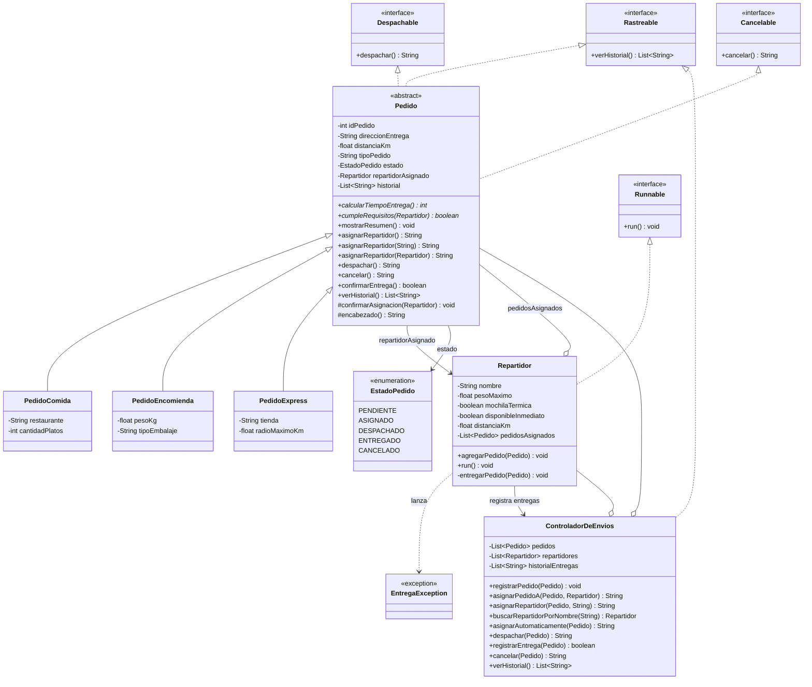

# SpeedFast — Sistema de Gestión de Entregas

## Descripción

SpeedFast es un prototipo de software desarrollado en Java para las actividades formativas y sumativas de la asignatura **Desarrollo Orientado a Objetos II**. Modela la operación de una empresa de reparto a domicilio que ofrece tres tipos de servicio: pedidos de comida de restaurantes, encomiendas (documentos o paquetes) y compras express en supermercado o farmacia.

El proyecto se construye de forma incremental:

* **Semana 1 — "Explorando la sobrecarga y sobreescritura en clases derivadas"**: jerarquía de pedidos y método `asignarRepartidor()` sobrecargado y sobrescrito según el tipo de servicio.
* **Semana 2 — "Definiendo una clase abstracta y su jerarquía"**: `Pedido` se convierte en **clase abstracta**, se incorpora el atributo común `distanciaKm`, el método implementado `mostrarResumen()` y el método abstracto `calcularTiempoEntrega()`.
* **Semana 3 — "Diseñando un sistema orientado a objetos con clases abstractas, polimorfismo e interfaces"**: se incorporan las interfaces `Despachable`, `Cancelable` y `Rastreable`, el estado del pedido, y la clase `ControladorDeEnvios`, que concentra la lógica de gestión sobre colecciones dinámicas (`ArrayList`).
* **Semana 4 — "Ejecutando tareas en paralelo con hilos en Java"**: `Repartidor` implementa `Runnable` y cada repartidor pasa a ejecutarse como un hilo independiente que recorre su propia lista de pedidos. `Main` lanza a todos los repartidores en paralelo con `ExecutorService`, y el acceso al historial compartido se protege con `synchronized`.

> El proyecto se mantiene como un único proyecto Maven en la raíz del repositorio: cada semana se construye sobre la anterior, y el avance semanal queda registrado en los commits en lugar de duplicar el código en carpetas separadas.

Cada tipo de pedido tiene criterios distintos, tanto para asignar repartidor como para estimar su tiempo de entrega:

* **Comida** — requiere un repartidor con mochila térmica.
* **Encomienda** — requiere validar el peso del bulto y su embalaje.
* **Compra express** — debe asignarse al repartidor más cercano con disponibilidad inmediata.

El sistema aplica los principios fundamentales de la Programación Orientada a Objetos:

* **Abstracción** — `Pedido` es una clase abstracta: reúne lo común a todo pedido y no puede instanciarse por sí sola, ya que un "pedido genérico" no existe en el dominio.
* **Encapsulamiento** — todos los atributos son `private` y se acceden mediante getters y setters públicos. El estado del pedido solo cambia a través de sus propias operaciones.
* **Herencia** — jerarquía `Pedido → PedidoComida / PedidoEncomienda / PedidoExpress`, donde la clase base concentra los atributos y el comportamiento común.
* **Métodos abstractos** — `calcularTiempoEntrega()` y `cumpleRequisitos()` se declaran sin cuerpo en la clase base y obligan a cada subclase a definir su propia regla.
* **Sobrescritura (*overriding*)** — cada subclase redefine `asignarRepartidor()`, `calcularTiempoEntrega()` y `cumpleRequisitos()` con `@Override`.
* **Sobrecarga (*overloading*)** — el método `asignarRepartidor()` existe en tres firmas distintas: sin parámetros, con el nombre del repartidor (`String`) y con el objeto `Repartidor` completo.
* **Interfaces** — `Despachable`, `Cancelable` y `Rastreable` desacoplan las operaciones de despacho, cancelación y seguimiento de la jerarquía de pedidos.
* **Polimorfismo** — el `ControladorDeEnvios` trabaja con referencias `Pedido` y con listas `List<Pedido>`, sin conocer el tipo concreto de cada objeto.
* **Colecciones dinámicas** — el controlador administra `ArrayList` de pedidos, repartidores e historial de entregas.
* **Separación de responsabilidades** — la lógica de gestión vive en `ControladorDeEnvios`; `Main` solo simula y presenta resultados.
* **Concurrencia** — `Repartidor` implementa `Runnable` y se ejecuta en paralelo mediante `ExecutorService`, con pausas aleatorias que simulan cada entrega.
* **Sincronización** — los métodos que modifican estado compartido son `synchronized`, evitando condiciones de carrera sobre el historial de entregas.
* **Manejo de excepciones** — `EntregaException` e `InterruptedException` se capturan por pedido, de modo que un fallo no detiene el recorrido completo.

---

## Estructura del proyecto

```text
speedfast/
├── src/main/java/com/speedfast/
│   ├── app/
│   │   └── Main.java                  # Simulación completa del sistema
│   ├── model/
│   │   ├── Pedido.java                # Clase abstracta; implementa las 3 interfaces
│   │   ├── PedidoComida.java          # Mochila térmica · 15 min + 2 min/km
│   │   ├── PedidoEncomienda.java      # Peso y embalaje · 20 min + 1,5 min/km
│   │   ├── PedidoExpress.java         # Cercanía y disponibilidad · 10 min (+5 si > 5 km)
│   │   ├── Repartidor.java            # Implementa Runnable: entrega sus pedidos en un hilo
│   │   ├── EstadoPedido.java          # Enum: pendiente, asignado, despachado, entregado, cancelado
│   │   ├── Despachable.java           # Interfaz: despachar()
│   │   ├── Cancelable.java            # Interfaz: cancelar()
│   │   └── Rastreable.java            # Interfaz: verHistorial()
│   ├── exception/
│   │   └── EntregaException.java      # Error de dominio al entregar un pedido
│   └── service/
│       └── ControladorDeEnvios.java   # Lógica de gestión, colecciones y sincronización
├── pom.xml
└── README.md
```

---

## Diagrama de clases



---

## Clases principales

* **`Pedido`** *(abstracta)* — atributos comunes: `idPedido`, `direccionEntrega`, `distanciaKm`, `tipoPedido`, `estado`, `repartidorAsignado` e `historial`. Implementa las tres interfaces y ofrece `mostrarResumen()`, `confirmarAsignacion()` y `encabezado()` como comportamiento reutilizable.
* **`PedidoComida`** — agrega `restaurante` y `cantidadPlatos`. Solo acepta repartidores con **mochila térmica**.
* **`PedidoEncomienda`** — agrega `pesoKg` y `tipoEmbalaje`. Valida la **capacidad de carga** del repartidor y que el **embalaje** esté declarado.
* **`PedidoExpress`** — agrega `tienda` y `radioMaximoKm`. Exige **disponibilidad inmediata** y **cercanía** dentro del radio de cobertura.
* **`Repartidor`** — datos del repartidor (`pesoMaximo`, `mochilaTermica`, `disponibleInmediato`, `distanciaKm`), que son los atributos que permiten validar cada tipo de pedido. Implementa `Runnable`: mantiene su lista de `pedidosAsignados` y su método `run()` los entrega uno a uno, simulando el traslado con pausas aleatorias.
* **`EstadoPedido`** — enumeración con los estados válidos de un pedido, evitando textos sueltos repartidos por el código.
* **`EntregaException`** — excepción de dominio que permite informar por qué falló una entrega sin interrumpir el recorrido completo del repartidor.
* **`ControladorDeEnvios`** — registra pedidos y repartidores, asigna, despacha, cancela y mantiene el historial de entregas. Sus métodos son `synchronized` porque varios hilos de repartidor lo utilizan al mismo tiempo.

### Interfaces implementadas

| Interfaz | Método | Implementada por | Propósito |
|---|---|---|---|
| `Despachable` | `despachar()` | `PedidoComida`, `PedidoEncomienda`, `PedidoExpress` (heredado de `Pedido`) | Enviar el pedido a reparto validando su estado |
| `Cancelable` | `cancelar()` | `PedidoComida`, `PedidoEncomienda`, `PedidoExpress` (heredado de `Pedido`) | Anular un pedido que aún no ha sido despachado |
| `Rastreable` | `verHistorial()` | `Pedido` y `ControladorDeEnvios` | Consultar el avance: eventos del pedido e historial global del sistema |

### Método abstracto `calcularTiempoEntrega()`

| Subclase | Fórmula | Ejemplo |
|---|---|---|
| `PedidoComida` | 15 min base + 2 min por kilómetro | 4 km → **23 minutos** |
| `PedidoEncomienda` | 20 min base + 1,5 min por kilómetro (redondeado a entero) | 6 km → **29 minutos** |
| `PedidoExpress` | 10 min base, +5 min si la distancia supera los 5 km | 7 km → **15 minutos** |

### Método abstracto `cumpleRequisitos(Repartidor)`

Permite que el `ControladorDeEnvios` busque un repartidor adecuado **sin conocer las reglas de cada tipo de pedido**: se las pregunta al propio pedido.

| Subclase | Requisito |
|---|---|
| `PedidoComida` | El repartidor cuenta con mochila térmica |
| `PedidoEncomienda` | La carga no supera la capacidad del repartidor y hay embalaje declarado |
| `PedidoExpress` | El repartidor tiene disponibilidad inmediata y está dentro del radio de cobertura |

### Sobrecarga del método `asignarRepartidor()`

| Firma | Comportamiento |
|---|---|
| `asignarRepartidor()` | Mensaje genérico: aún no se designa a nadie |
| `asignarRepartidor(String nombreRepartidor)` | Registra el candidato en el historial del pedido y advierte que la asignación aún no se confirma: sin el objeto no es posible validar los requisitos |
| `asignarRepartidor(Repartidor repartidor)` | Valida los requisitos del tipo de pedido y, si se cumplen, registra la asignación |

Para asignar por nombre de forma efectiva se usa `ControladorDeEnvios.asignarRepartidor(pedido, nombre)`: el controlador es quien conoce la lista de repartidores, resuelve el nombre y delega en la versión que sí valida. Así el mensaje mostrado en consola nunca afirma algo que el estado del objeto no refleje.

---

## Concurrencia (Semana 4)

Cada repartidor se ejecuta como un hilo independiente que recorre su propia lista de pedidos:

| Elemento | Uso en el proyecto |
|---|---|
| `Runnable` | `Repartidor` lo implementa; su método `run()` recorre `pedidosAsignados` y entrega uno a uno |
| `Thread.sleep()` | Simula el traslado con una pausa aleatoria de entre 500 y 2000 ms por pedido |
| `ExecutorService` | `Main` usa `Executors.newFixedThreadPool(3)` para lanzar a los tres repartidores en paralelo |
| `shutdown()` + `awaitTermination()` | La simulación continúa hasta que todos los repartidores terminan sus entregas |
| `synchronized` | Protege el historial compartido en `ControladorDeEnvios` y las transiciones de estado de `Pedido` |

Como cada repartidor solo toca sus propios pedidos y el único recurso realmente compartido es el `ControladorDeEnvios`, basta con sincronizar sus métodos. Ninguno de ellos realiza pausas, por lo que los hilos nunca quedan bloqueados esperando a otro.

### Manejo de excepciones

| Punto crítico | Tratamiento |
|---|---|
| `Thread.sleep()` durante una entrega | Se captura `InterruptedException`, se restaura la marca de interrupción y el repartidor termina de forma controlada |
| Pedido que no puede entregarse | Se lanza `EntregaException` y se captura por pedido: el repartidor informa el motivo y continúa con el siguiente |
| Error inesperado dentro del hilo | Un `catch (RuntimeException)` evita que el hilo muera en silencio, ya que `execute()` no propaga las excepciones |
| `awaitTermination()` en `Main` | Se captura `InterruptedException`, se llama a `shutdownNow()` y se restaura la interrupción |
| Repartidor sin pedidos | Se informa por consola en lugar de tratarse como error |

---

## Aporte del diseño a la escalabilidad, reutilización y mantenibilidad

* **Escalabilidad** — agregar un nuevo tipo de servicio (por ejemplo, `PedidoFarmacia`) solo requiere crear una subclase de `Pedido` e implementar sus dos métodos abstractos. Ni `ControladorDeEnvios` ni `Main` necesitan modificarse, porque ambos trabajan con referencias `Pedido`.
* **Reutilización** — el estado, el historial, el despacho, la cancelación y `mostrarResumen()` se escriben una sola vez en la clase abstracta y quedan disponibles para las tres subclases. `encabezado()` evita repetir el formato de los mensajes.
* **Mantenibilidad** — cada regla de negocio vive en un solo lugar: las fórmulas de tiempo y los requisitos de asignación están en su subclase, la disponibilidad de repartidores en el controlador, y los estados válidos en el enum `EstadoPedido`. Las interfaces permiten que otras clases usen las operaciones sin depender de la jerarquía concreta.

---

## Requisitos

* Java 21 o superior.
* Maven.
* IntelliJ IDEA (recomendado).

---

## Instrucciones para clonar y ejecutar

```bash
git clone https://github.com/sara-rioseco/speedfast.git
cd speedfast
mvn compile
mvn exec:java -Dexec.mainClass="com.speedfast.app.Main"
```

Desde IntelliJ IDEA: abrir el proyecto y ejecutar el método `main()` de la clase `Main` (paquete `com.speedfast.app`).

Al ejecutar el programa, la consola muestra cinco secciones:

1. **Preparación** — se registran tres repartidores y siete pedidos, y se asignan según el perfil de cada repartidor (Juan tiene mochila térmica, Camila dispone de furgón y Luis se mueve en bicicleta dentro del radio de cobertura).
2. **Simulación concurrente** — los tres repartidores entregan en paralelo; sus mensajes aparecen intercalados, lo que evidencia que los hilos se ejecutan simultáneamente.
3. **Estado final** — tabla con el estado y el tiempo estimado de cada pedido.
4. **Cancelación** — interfaz `Cancelable` sobre el pedido que quedó pendiente.
5. **Historial** — interfaz `Rastreable`: las seis entregas realizadas por el sistema.

### Ejemplo de salida

```text
==============================================================
2. SIMULACIÓN CONCURRENTE DE ENTREGAS
==============================================================
[Repartidor: Juan] Entregando Pedido de Comida #101... (23 min estimados)
[Repartidor: Camila] Entregando Pedido de Encomienda #103... (29 min estimados)
[Repartidor: Luis] Entregando Pedido Express #105... (15 min estimados)
[Repartidor: Luis] Pedido #105 entregado.
[Repartidor: Luis] Entregando Pedido Express #106... (10 min estimados)
[Repartidor: Juan] Pedido #101 entregado.
[Repartidor: Juan] Entregando Pedido de Comida #102... (27 min estimados)
[Repartidor: Camila] Pedido #103 entregado.
[Repartidor: Camila] Entregando Pedido de Encomienda #104... (34 min estimados)
[Repartidor: Luis] Pedido #106 entregado.
[Repartidor: Luis] Recorrido finalizado.
[Repartidor: Juan] Pedido #102 entregado.
[Repartidor: Juan] Recorrido finalizado.
[Repartidor: Camila] Pedido #104 entregado.
[Repartidor: Camila] Recorrido finalizado.

[Sistema] Todos los repartidores finalizaron sus entregas.

==============================================================
5. HISTORIAL DE ENTREGAS (Rastreable)
==============================================================
 - Pedido de Comida #101 — entregado por Juan Pérez
 - Pedido Express #105 — entregado por Luis Díaz
 - Pedido de Encomienda #103 — entregado por Camila Soto
 - Pedido de Comida #102 — entregado por Juan Pérez
 - Pedido Express #106 — entregado por Luis Díaz
 - Pedido de Encomienda #104 — entregado por Camila Soto
```

El orden de las líneas cambia en cada ejecución, ya que las pausas son aleatorias, pero siempre se completan las seis entregas.

---

## Autor

Sara Rioseco
