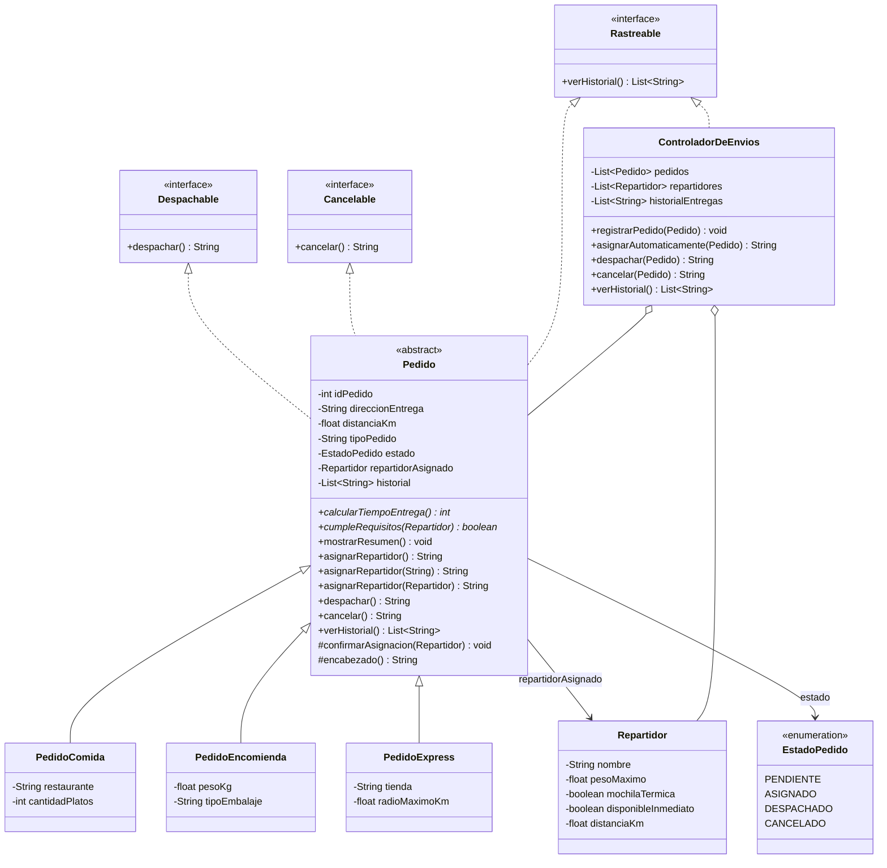

# SpeedFast — Sistema de Gestión de Entregas

## Descripción

SpeedFast es un prototipo de software desarrollado en Java para las actividades formativas y sumativas de la asignatura **Desarrollo Orientado a Objetos II**. Modela la operación de una empresa de reparto a domicilio que ofrece tres tipos de servicio: pedidos de comida de restaurantes, encomiendas (documentos o paquetes) y compras express en supermercado o farmacia.

El proyecto se construye de forma incremental:

* **Semana 1 — "Explorando la sobrecarga y sobreescritura en clases derivadas"**: jerarquía de pedidos y método `asignarRepartidor()` sobrecargado y sobrescrito según el tipo de servicio.
* **Semana 2 — "Definiendo una clase abstracta y su jerarquía"**: `Pedido` se convierte en **clase abstracta**, se incorpora el atributo común `distanciaKm`, el método implementado `mostrarResumen()` y el método abstracto `calcularTiempoEntrega()`.
* **Semana 3 — "Diseñando un sistema orientado a objetos con clases abstractas, polimorfismo e interfaces"**: se incorporan las interfaces `Despachable`, `Cancelable` y `Rastreable`, el estado del pedido, y la clase `ControladorDeEnvios`, que concentra la lógica de gestión sobre colecciones dinámicas (`ArrayList`).

Cada tipo de pedido tiene criterios distintos, tanto para asignar repartidor como para estimar su tiempo de entrega:

* **Comida** — requiere un repartidor con mochila térmica.
* **Encomienda** — requiere validar el peso del bulto y su embalaje.
* **Compra express** — debe asignarse al repartidor más cercano con disponibilidad inmediata.

El sistema aplica los principios fundamentales de la Programación Orientada a Objetos:

* **Abstracción** — `Pedido` es una clase abstracta: reúne lo común a todo pedido y no puede instanciarse por sí sola, ya que un "pedido genérico" no existe en el dominio.
* **Encapsulamiento** — todos los atributos son `private` y se acceden mediante getters y setters públicos. El estado del pedido solo cambia a través de sus propias operaciones.
* **Herencia** — jerarquía `Pedido → PedidoComida / PedidoEncomienda / PedidoExpress`, donde la clase base concentra los atributos y el comportamiento común.
* **Métodos abstractos** — `calcularTiempoEntrega()` y `cumpleRequisitos()` se declaran sin cuerpo en la clase base y obligan a cada subclase a definir su propia regla.
* **Sobrescritura (*overriding*)** — cada subclase redefine `asignarRepartidor()`, `calcularTiempoEntrega()` y `cumpleRequisitos()` con `@Override`.
* **Sobrecarga (*overloading*)** — el método `asignarRepartidor()` existe en tres firmas distintas: sin parámetros, con el nombre del repartidor (`String`) y con el objeto `Repartidor` completo.
* **Interfaces** — `Despachable`, `Cancelable` y `Rastreable` desacoplan las operaciones de despacho, cancelación y seguimiento de la jerarquía de pedidos.
* **Polimorfismo** — el `ControladorDeEnvios` trabaja con referencias `Pedido` y con listas `List<Pedido>`, sin conocer el tipo concreto de cada objeto.
* **Colecciones dinámicas** — el controlador administra `ArrayList` de pedidos, repartidores e historial de entregas.
* **Separación de responsabilidades** — la lógica de gestión vive en `ControladorDeEnvios`; `Main` solo simula y presenta resultados.

---

## Estructura del proyecto

```text
speedfast/
├── src/main/java/com/speedfast/
│   ├── app/
│   │   └── Main.java                  # Simulación completa del sistema
│   ├── model/
│   │   ├── Pedido.java                # Clase abstracta; implementa las 3 interfaces
│   │   ├── PedidoComida.java          # Mochila térmica · 15 min + 2 min/km
│   │   ├── PedidoEncomienda.java      # Peso y embalaje · 20 min + 1,5 min/km
│   │   ├── PedidoExpress.java         # Cercanía y disponibilidad · 10 min (+5 si > 5 km)
│   │   ├── Repartidor.java            # Repartidor de la plataforma
│   │   ├── EstadoPedido.java          # Enum: pendiente, asignado, despachado, cancelado
│   │   ├── Despachable.java           # Interfaz: despachar()
│   │   ├── Cancelable.java            # Interfaz: cancelar()
│   │   └── Rastreable.java            # Interfaz: verHistorial()
│   └── service/
│       └── ControladorDeEnvios.java   # Lógica de gestión y colecciones dinámicas
├── pom.xml
└── README.md
```

---

## Diagrama de clases



---

## Clases principales

* **`Pedido`** *(abstracta)* — atributos comunes: `idPedido`, `direccionEntrega`, `distanciaKm`, `tipoPedido`, `estado`, `repartidorAsignado` e `historial`. Implementa las tres interfaces y ofrece `mostrarResumen()`, `confirmarAsignacion()` y `encabezado()` como comportamiento reutilizable.
* **`PedidoComida`** — agrega `restaurante` y `cantidadPlatos`. Solo acepta repartidores con **mochila térmica**.
* **`PedidoEncomienda`** — agrega `pesoKg` y `tipoEmbalaje`. Valida la **capacidad de carga** del repartidor y que el **embalaje** esté declarado.
* **`PedidoExpress`** — agrega `tienda` y `radioMaximoKm`. Exige **disponibilidad inmediata** y **cercanía** dentro del radio de cobertura.
* **`Repartidor`** — datos del repartidor, incluidos `pesoMaximo`, `mochilaTermica`, `disponibleInmediato` y `distanciaKm`, que son los atributos que permiten validar cada tipo de pedido.
* **`EstadoPedido`** — enumeración con los estados válidos de un pedido, evitando textos sueltos repartidos por el código.
* **`ControladorDeEnvios`** — registra pedidos y repartidores, asigna automáticamente, despacha, cancela y mantiene el historial de entregas.

### Interfaces implementadas

| Interfaz | Método | Implementada por | Propósito |
|---|---|---|---|
| `Despachable` | `despachar()` | `PedidoComida`, `PedidoEncomienda`, `PedidoExpress` (heredado de `Pedido`) | Enviar el pedido a reparto validando su estado |
| `Cancelable` | `cancelar()` | `PedidoComida`, `PedidoEncomienda`, `PedidoExpress` (heredado de `Pedido`) | Anular un pedido que aún no ha sido despachado |
| `Rastreable` | `verHistorial()` | `Pedido` y `ControladorDeEnvios` | Consultar el avance: eventos del pedido e historial global del sistema |

### Método abstracto `calcularTiempoEntrega()`

| Subclase | Fórmula | Ejemplo |
|---|---|---|
| `PedidoComida` | 15 min base + 2 min por kilómetro | 4 km → **23 minutos** |
| `PedidoEncomienda` | 20 min base + 1,5 min por kilómetro (redondeado a entero) | 6 km → **29 minutos** |
| `PedidoExpress` | 10 min base, +5 min si la distancia supera los 5 km | 7 km → **15 minutos** |

### Método abstracto `cumpleRequisitos(Repartidor)`

Permite que el `ControladorDeEnvios` busque un repartidor adecuado **sin conocer las reglas de cada tipo de pedido**: se las pregunta al propio pedido.

| Subclase | Requisito |
|---|---|
| `PedidoComida` | El repartidor cuenta con mochila térmica |
| `PedidoEncomienda` | La carga no supera la capacidad del repartidor y hay embalaje declarado |
| `PedidoExpress` | El repartidor tiene disponibilidad inmediata y está dentro del radio de cobertura |

### Sobrecarga del método `asignarRepartidor()`

| Firma | Comportamiento |
|---|---|
| `asignarRepartidor()` | Mensaje genérico: aún no se designa a nadie |
| `asignarRepartidor(String nombreRepartidor)` | Mensaje informativo con el nombre indicado |
| `asignarRepartidor(Repartidor repartidor)` | Valida los requisitos del tipo de pedido y, si se cumplen, registra la asignación |

---

## Aporte del diseño a la escalabilidad, reutilización y mantenibilidad

* **Escalabilidad** — agregar un nuevo tipo de servicio (por ejemplo, `PedidoFarmacia`) solo requiere crear una subclase de `Pedido` e implementar sus dos métodos abstractos. Ni `ControladorDeEnvios` ni `Main` necesitan modificarse, porque ambos trabajan con referencias `Pedido`.
* **Reutilización** — el estado, el historial, el despacho, la cancelación y `mostrarResumen()` se escriben una sola vez en la clase abstracta y quedan disponibles para las tres subclases. `encabezado()` evita repetir el formato de los mensajes.
* **Mantenibilidad** — cada regla de negocio vive en un solo lugar: las fórmulas de tiempo y los requisitos de asignación están en su subclase, la disponibilidad de repartidores en el controlador, y los estados válidos en el enum `EstadoPedido`. Las interfaces permiten que otras clases usen las operaciones sin depender de la jerarquía concreta.

---

## Requisitos

* Java 21 o superior.
* Maven.
* IntelliJ IDEA (recomendado).

---

## Instrucciones para clonar y ejecutar

```bash
git clone https://github.com/sara-rioseco/speedfast.git
cd speedfast
mvn compile
mvn exec:java -Dexec.mainClass="com.speedfast.app.Main"
```

Desde IntelliJ IDEA: abrir el proyecto y ejecutar el método `main()` de la clase `Main` (paquete `com.speedfast.app`).

Al ejecutar el programa, la consola muestra siete secciones:

1. **Pedidos registrados** — estado inicial del sistema.
2. **Asignación automática** — el controlador busca un repartidor que cumpla los requisitos de cada pedido.
3. **Asignación manual** — las tres versiones sobrecargadas de `asignarRepartidor()`, incluido un caso rechazado.
4. **Resumen y tiempo estimado** — `mostrarResumen()` de cada pedido y tabla comparativa.
5. **Despacho** — interfaz `Despachable`.
6. **Cancelación** — interfaz `Cancelable`, incluido un caso rechazado por pedido ya despachado.
7. **Historial** — interfaz `Rastreable`: entregas del sistema y seguimiento de un pedido.

### Ejemplo de salida

```text
==============================================================
5. DESPACHO DE PEDIDOS (Despachable)
==============================================================
Pedido 101 despachado correctamente con Juan Pérez (23 minutos estimados).
Pedido 102 despachado correctamente con Camila Soto (29 minutos estimados).

==============================================================
6. CANCELACIÓN DE PEDIDOS (Cancelable)
==============================================================
Cancelando Pedido Express #103...
Pedido 103 cancelado exitosamente.

Cancelando Pedido de Comida #101...
No se puede cancelar el pedido 101: ya fue despachado.

==============================================================
7. HISTORIAL DE ENTREGAS (Rastreable)
==============================================================
Entregas realizadas por el sistema:
 - Pedido de Comida #101 — entregado por Juan Pérez
 - Pedido de Encomienda #102 — entregado por Camila Soto

Seguimiento del Pedido Express #103:
 - Pedido registrado en el sistema
 - Repartidor asignado: Luis Díaz
 - Pedido cancelado
```

---

## Autor

Sara Rioseco
