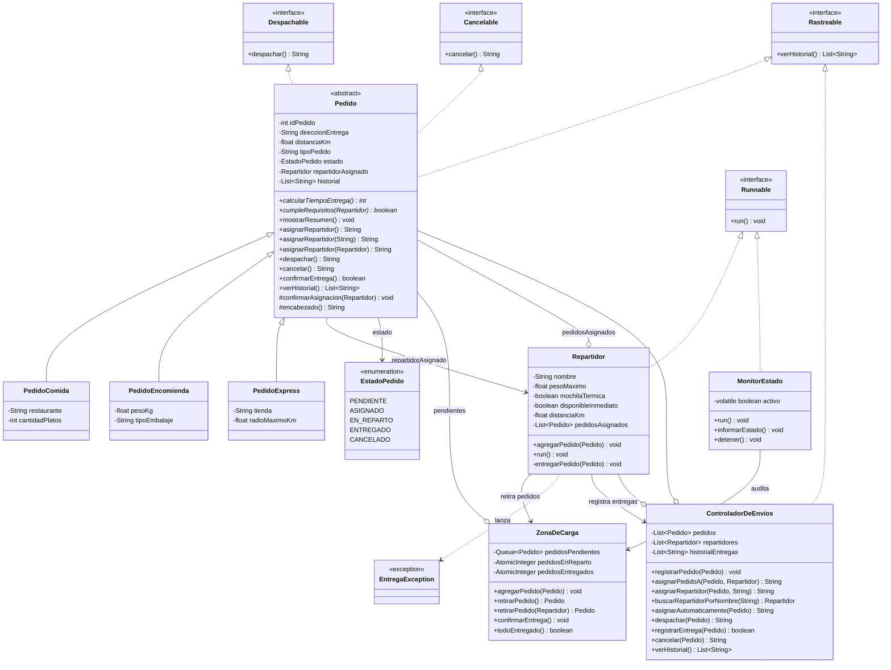

# SpeedFast — Sistema de Gestión de Entregas

## Descripción

SpeedFast es un prototipo de software desarrollado en Java para las actividades formativas y sumativas de la asignatura **Desarrollo Orientado a Objetos II**. Modela la operación de una empresa de reparto a domicilio que ofrece tres tipos de servicio: pedidos de comida de restaurantes, encomiendas (documentos o paquetes) y compras express en supermercado o farmacia.

El proyecto se construye de forma incremental:

* **Semana 1 — "Explorando la sobrecarga y sobreescritura en clases derivadas"**: jerarquía de pedidos y método `asignarRepartidor()` sobrecargado y sobrescrito según el tipo de servicio.
* **Semana 2 — "Definiendo una clase abstracta y su jerarquía"**: `Pedido` se convierte en **clase abstracta**, se incorpora el atributo común `distanciaKm`, el método implementado `mostrarResumen()` y el método abstracto `calcularTiempoEntrega()`.
* **Semana 3 — "Diseñando un sistema orientado a objetos con clases abstractas, polimorfismo e interfaces"**: se incorporan las interfaces `Despachable`, `Cancelable` y `Rastreable`, el estado del pedido, y la clase `ControladorDeEnvios`, que concentra la lógica de gestión sobre colecciones dinámicas (`ArrayList`).
* **Semana 4 — "Ejecutando tareas en paralelo con hilos en Java"**: `Repartidor` implementa `Runnable` y cada repartidor pasa a ejecutarse como un hilo independiente que recorre su propia lista de pedidos. `Main` lanza a todos los repartidores en paralelo con `ExecutorService`, y el acceso al historial compartido se protege con `synchronized`.
* **Semana 5 — "Sincronizando procesos en sistemas concurrentes"**: los pedidos dejan de repartirse de antemano y pasan a una `ZonaDeCarga` compartida, desde la cual los repartidores los retiran de a uno compitiendo entre sí. La sincronización garantiza que cada pedido sea retirado y entregado por un único repartidor, y un `MonitorEstado` audita el sistema en tiempo real.

> El proyecto se mantiene como un único proyecto Maven en la raíz del repositorio: cada semana se construye sobre la anterior, y el avance semanal queda registrado en los commits en lugar de duplicar el código en carpetas separadas.

Cada tipo de pedido tiene criterios distintos, tanto para asignar repartidor como para estimar su tiempo de entrega:

* **Comida** — requiere un repartidor con mochila térmica.
* **Encomienda** — requiere validar el peso del bulto y su embalaje.
* **Compra express** — debe asignarse al repartidor más cercano con disponibilidad inmediata.

El sistema aplica los principios fundamentales de la Programación Orientada a Objetos:

* **Abstracción** — `Pedido` es una clase abstracta: reúne lo común a todo pedido y no puede instanciarse por sí sola, ya que un "pedido genérico" no existe en el dominio.
* **Encapsulamiento** — todos los atributos son `private` y se acceden mediante getters y setters públicos. El estado del pedido solo cambia a través de sus propias operaciones.
* **Herencia** — jerarquía `Pedido → PedidoComida / PedidoEncomienda / PedidoExpress`, donde la clase base concentra los atributos y el comportamiento común.
* **Métodos abstractos** — `calcularTiempoEntrega()` y `cumpleRequisitos()` se declaran sin cuerpo en la clase base y obligan a cada subclase a definir su propia regla.
* **Sobrescritura (*overriding*)** — cada subclase redefine `asignarRepartidor()`, `calcularTiempoEntrega()` y `cumpleRequisitos()` con `@Override`.
* **Sobrecarga (*overloading*)** — el método `asignarRepartidor()` existe en tres firmas distintas: sin parámetros, con el nombre del repartidor (`String`) y con el objeto `Repartidor` completo.
* **Interfaces** — `Despachable`, `Cancelable` y `Rastreable` desacoplan las operaciones de despacho, cancelación y seguimiento de la jerarquía de pedidos.
* **Polimorfismo** — el `ControladorDeEnvios` trabaja con referencias `Pedido` y con listas `List<Pedido>`, sin conocer el tipo concreto de cada objeto.
* **Colecciones dinámicas** — el controlador administra `ArrayList` de pedidos, repartidores e historial de entregas.
* **Separación de responsabilidades** — la lógica de gestión vive en `ControladorDeEnvios`; `Main` solo simula y presenta resultados.
* **Concurrencia** — `Repartidor` implementa `Runnable` y se ejecuta en paralelo mediante `ExecutorService`, con pausas aleatorias que simulan cada entrega.
* **Recurso compartido** — la `ZonaDeCarga` es accedida simultáneamente por los tres hilos de repartidor; sus métodos `synchronized` garantizan que cada pedido sea retirado por un único repartidor.
* **Sincronización** — `synchronized` protege las secciones críticas, `AtomicInteger` lleva los contadores sin bloqueo y `volatile` comunica la orden de detención al monitor.
* **Manejo de excepciones** — `EntregaException` e `InterruptedException` se capturan por pedido, de modo que un fallo no detiene el recorrido completo.

---

## Estructura del proyecto

```text
speedfast/
├── src/main/java/com/speedfast/
│   ├── app/
│   │   └── Main.java                  # Simulación completa del sistema
│   ├── model/
│   │   ├── Pedido.java                # Clase abstracta; implementa las 3 interfaces
│   │   ├── PedidoComida.java          # Mochila térmica · 15 min + 2 min/km
│   │   ├── PedidoEncomienda.java      # Peso y embalaje · 20 min + 1,5 min/km
│   │   ├── PedidoExpress.java         # Cercanía y disponibilidad · 10 min (+5 si > 5 km)
│   │   ├── Repartidor.java            # Implementa Runnable: retira y entrega pedidos en un hilo
│   │   ├── EstadoPedido.java          # Enum: pendiente, asignado, en reparto, entregado, cancelado
│   │   ├── Despachable.java           # Interfaz: despachar()
│   │   ├── Cancelable.java            # Interfaz: cancelar()
│   │   └── Rastreable.java            # Interfaz: verHistorial()
│   ├── exception/
│   │   └── EntregaException.java      # Error de dominio al entregar un pedido
│   └── service/
│       ├── ZonaDeCarga.java           # Recurso compartido: retiro sincronizado de pedidos
│       ├── MonitorEstado.java         # Hilo que audita el sistema en tiempo real
│       └── ControladorDeEnvios.java   # Lógica de gestión, colecciones y sincronización
├── pom.xml
└── README.md
```

---

## Diagrama de clases



---

## Clases principales

* **`Pedido`** *(abstracta)* — atributos comunes: `idPedido`, `direccionEntrega`, `distanciaKm`, `tipoPedido`, `estado`, `repartidorAsignado` e `historial`. Implementa las tres interfaces y ofrece `mostrarResumen()`, `confirmarAsignacion()` y `encabezado()` como comportamiento reutilizable.
* **`PedidoComida`** — agrega `restaurante` y `cantidadPlatos`. Solo acepta repartidores con **mochila térmica**.
* **`PedidoEncomienda`** — agrega `pesoKg` y `tipoEmbalaje`. Valida la **capacidad de carga** del repartidor y que el **embalaje** esté declarado.
* **`PedidoExpress`** — agrega `tienda` y `radioMaximoKm`. Exige **disponibilidad inmediata** y **cercanía** dentro del radio de cobertura.
* **`Repartidor`** — datos del repartidor (`pesoMaximo`, `mochilaTermica`, `disponibleInmediato`, `distanciaKm`), que son los atributos que permiten validar cada tipo de pedido. Implementa `Runnable`: su método `run()` retira pedidos de la `ZonaDeCarga` mientras queden compatibles con su perfil, y los entrega simulando el traslado con pausas aleatorias.
* **`ZonaDeCarga`** — recurso compartido donde llegan los pedidos. Sus métodos `agregarPedido()` y `retirarPedido()` son `synchronized`, lo que impide que dos repartidores retiren el mismo pedido. Lleva contadores `AtomicInteger` de pedidos en reparto y entregados.
* **`MonitorEstado`** — hilo que informa periódicamente cuántos pedidos hay pendientes, en reparto y entregados. Consulta solo los contadores atómicos, por lo que audita el sistema sin interferir con el trabajo de los repartidores.
* **`EstadoPedido`** — enumeración con los estados válidos de un pedido, evitando textos sueltos repartidos por el código.
* **`EntregaException`** — excepción de dominio que permite informar por qué falló una entrega sin interrumpir el recorrido completo del repartidor.
* **`ControladorDeEnvios`** — registra pedidos y repartidores, asigna, despacha, cancela y mantiene el historial de entregas. Sus métodos son `synchronized` porque varios hilos de repartidor lo utilizan al mismo tiempo.

### Interfaces implementadas

| Interfaz | Método | Implementada por | Propósito |
|---|---|---|---|
| `Despachable` | `despachar()` | `PedidoComida`, `PedidoEncomienda`, `PedidoExpress` (heredado de `Pedido`) | Enviar el pedido a reparto validando su estado |
| `Cancelable` | `cancelar()` | `PedidoComida`, `PedidoEncomienda`, `PedidoExpress` (heredado de `Pedido`) | Anular un pedido que aún no ha sido despachado |
| `Rastreable` | `verHistorial()` | `Pedido` y `ControladorDeEnvios` | Consultar el avance: eventos del pedido e historial global del sistema |

### Método abstracto `calcularTiempoEntrega()`

| Subclase | Fórmula | Ejemplo |
|---|---|---|
| `PedidoComida` | 15 min base + 2 min por kilómetro | 4 km → **23 minutos** |
| `PedidoEncomienda` | 20 min base + 1,5 min por kilómetro (redondeado a entero) | 6 km → **29 minutos** |
| `PedidoExpress` | 10 min base, +5 min si la distancia supera los 5 km | 7 km → **15 minutos** |

### Método abstracto `cumpleRequisitos(Repartidor)`

Permite que el `ControladorDeEnvios` busque un repartidor adecuado **sin conocer las reglas de cada tipo de pedido**: se las pregunta al propio pedido.

| Subclase | Requisito |
|---|---|
| `PedidoComida` | El repartidor cuenta con mochila térmica |
| `PedidoEncomienda` | La carga no supera la capacidad del repartidor y hay embalaje declarado |
| `PedidoExpress` | El repartidor tiene disponibilidad inmediata y está dentro del radio de cobertura |

### Sobrecarga del método `asignarRepartidor()`

| Firma | Comportamiento |
|---|---|
| `asignarRepartidor()` | Mensaje genérico: aún no se designa a nadie |
| `asignarRepartidor(String nombreRepartidor)` | Registra el candidato en el historial del pedido y advierte que la asignación aún no se confirma: sin el objeto no es posible validar los requisitos |
| `asignarRepartidor(Repartidor repartidor)` | Valida los requisitos del tipo de pedido y, si se cumplen, registra la asignación |

Para asignar por nombre de forma efectiva se usa `ControladorDeEnvios.asignarRepartidor(pedido, nombre)`: el controlador es quien conoce la lista de repartidores, resuelve el nombre y delega en la versión que sí valida. Así el mensaje mostrado en consola nunca afirma algo que el estado del objeto no refleje.

---

## Concurrencia y sincronización (Semanas 4 y 5)

En la Semana 4 cada repartidor recorría una lista de pedidos que se le asignaba de antemano, por lo que en la práctica no competía con nadie. En la Semana 5 los pedidos pasan a una **zona de carga común** y los repartidores los retiran de a uno: recién ahí aparece la competencia real por un recurso compartido, y con ella el riesgo de que dos repartidores tomen el mismo pedido.

| Mecanismo | Uso en el proyecto |
|---|---|
| `Runnable` | Lo implementan `Repartidor` (retira y entrega pedidos) y `MonitorEstado` (informa el avance) |
| `ExecutorService` | `Main` usa `Executors.newFixedThreadPool(3)` para lanzar a los tres repartidores en paralelo |
| `shutdown()` + `awaitTermination()` | La simulación continúa hasta que todos los repartidores terminan sus recorridos |
| `Thread.sleep()` | Simula el traslado con una pausa aleatoria de entre 500 y 2000 ms por pedido |
| `synchronized` | Protege `agregarPedido()` y `retirarPedido()` en `ZonaDeCarga`, las transiciones de estado de `Pedido` y el historial de `ControladorDeEnvios` |
| `AtomicInteger` | Contadores de pedidos en reparto y entregados, que el monitor consulta **sin tomar el bloqueo** |
| `volatile` | Bandera `activo` del `MonitorEstado`: el hilo ve de inmediato la orden de detenerse |

### Por qué `retirarPedido()` es la sección crítica

Sin sincronización, dos repartidores podrían consultar la cola en el mismo instante, ver el mismo pedido y retirarlo ambos: el pedido se entregaría dos veces. Al declarar el método `synchronized`, la consulta y la extracción ocurren de forma indivisible, de modo que el segundo repartidor solo entra cuando el primero ya retiró su pedido y este ya no está en la cola.

Ninguno de los métodos sincronizados realiza pausas — el `Thread.sleep()` ocurre **fuera** del bloqueo, mientras el repartidor viaja — por lo que los hilos nunca quedan esperando unos por otros y la ejecución se mantiene realmente paralela.

### Decisiones de diseño

* Se usó `synchronized` en lugar de `ReentrantLock` porque la zona de carga solo necesita exclusión mutua simple; no requiere intentos con tiempo límite ni múltiples condiciones de espera, que son las ventajas que justificarían el lock explícito.
* No se usó `Semaphore`: permitir que varios repartidores accedan a la vez a la zona de carga es precisamente el problema que se debe evitar, y un semáforo de un solo permiso equivaldría a `synchronized`.
* Los contadores del monitor son `AtomicInteger` y no variables protegidas por el mismo bloqueo, para que auditar el sistema no frene a los repartidores.
* Los atributos de `Repartidor` que definen su perfil (`pesoMaximo`, `mochilaTermica`, `tipoVehiculo`, `distanciaKm`, nombre e identificador) son `final` y ya no exponen setters. La zona de carga los consulta desde otro hilo al evaluar `cumpleRequisitos()`, de modo que un atributo inmutable garantiza que la decisión se tome siempre sobre datos estables. El único atributo mutable es `disponibleInmediato`, declarado `volatile` porque se escribe y se lee bajo bloqueos distintos.

### Manejo de excepciones

| Punto crítico | Tratamiento |
|---|---|
| `Thread.sleep()` durante una entrega | Se captura `InterruptedException`, se restaura la marca de interrupción y el repartidor termina de forma controlada |
| Pedido que no puede entregarse | Se lanza `EntregaException` y se captura por pedido: el repartidor informa el motivo y continúa con el siguiente |
| Error inesperado dentro del hilo | Un `catch (RuntimeException)` evita que el hilo muera en silencio, ya que `execute()` no propaga las excepciones |
| `awaitTermination()` en `Main` | Se captura `InterruptedException`, se llama a `shutdownNow()` y se restaura la interrupción |
| Repartidor sin pedidos | Se informa por consola en lugar de tratarse como error |

---

## Aporte del diseño a la escalabilidad, reutilización y mantenibilidad

* **Escalabilidad** — agregar un nuevo tipo de servicio (por ejemplo, `PedidoFarmacia`) solo requiere crear una subclase de `Pedido` e implementar sus dos métodos abstractos. Ni `ControladorDeEnvios` ni `Main` necesitan modificarse, porque ambos trabajan con referencias `Pedido`.
* **Reutilización** — el estado, el historial, el despacho, la cancelación y `mostrarResumen()` se escriben una sola vez en la clase abstracta y quedan disponibles para las tres subclases. `encabezado()` evita repetir el formato de los mensajes.
* **Mantenibilidad** — cada regla de negocio vive en un solo lugar: las fórmulas de tiempo y los requisitos de asignación están en su subclase, la disponibilidad de repartidores en el controlador, y los estados válidos en el enum `EstadoPedido`. Las interfaces permiten que otras clases usen las operaciones sin depender de la jerarquía concreta.

---

## Requisitos

* Java 21 o superior.
* Maven.
* IntelliJ IDEA (recomendado).

---

## Instrucciones para clonar y ejecutar

```bash
git clone https://github.com/sara-rioseco/speedfast.git
cd speedfast
mvn compile
mvn exec:java -Dexec.mainClass="com.speedfast.app.Main"
```

Desde IntelliJ IDEA: abrir el proyecto y ejecutar el método `main()` de la clase `Main` (paquete `com.speedfast.app`).

Al ejecutar el programa, la consola muestra cuatro secciones:

1. **Zona de carga inicializada** — ingresan seis pedidos a la zona de carga común.
2. **Repartidores trabajando en paralelo** — los tres repartidores retiran y entregan pedidos simultáneamente; sus mensajes aparecen intercalados junto con los informes del monitor, lo que evidencia la ejecución concurrente.
3. **Estado final** — tabla con el estado de cada pedido y el repartidor que lo entregó.
4. **Historial** — interfaz `Rastreable`: las entregas realizadas por el sistema, seguidas del mensaje de cierre.

### Ejemplo de salida

```text
==============================================================
1. ZONA DE CARGA INICIALIZADA
==============================================================
Pedido #101 agregado. Destino: Santiago Centro
Pedido #102 agregado. Destino: Providencia
Pedido #103 agregado. Destino: Ñuñoa
Pedido #104 agregado. Destino: Recoleta
Pedido #105 agregado. Destino: Las Condes
Pedido #106 agregado. Destino: Providencia

==============================================================
2. REPARTIDORES TRABAJANDO EN PARALELO
==============================================================
[Repartidor - Juan] Retirando pedido #101... Destino: Santiago Centro
[Repartidor - Juan] Estado: EN_REPARTO
[Repartidor - Juan] Entregando pedido #101... (23 min estimados)
[Repartidor - Camila] Retirando pedido #102... Destino: Providencia
[Repartidor - Camila] Estado: EN_REPARTO
[Repartidor - Camila] Entregando pedido #102... (29 min estimados)
[Repartidor - Pedro] Retirando pedido #103... Destino: Ñuñoa
[Repartidor - Pedro] Estado: EN_REPARTO
[Repartidor - Pedro] Entregando pedido #103... (10 min estimados)
   [Monitor] Pendientes: 3 | En reparto: 3 | Entregados: 0 de 6
[Repartidor - Camila] Estado: ENTREGADO
[Repartidor - Camila] Retirando pedido #105... Destino: Las Condes
...
[Repartidor - Juan] Recorrido finalizado: 2 pedidos entregados.

   [Monitor] Pendientes: 0 | En reparto: 0 | Entregados: 6 de 6

==============================================================
3. ESTADO FINAL DE LOS PEDIDOS
==============================================================
PEDIDO     DESTINO                  ESTADO           REPARTIDOR
--------------------------------------------------------------
#101       Santiago Centro          ENTREGADO        Juan Pérez
#102       Providencia              ENTREGADO        Camila Soto
#103       Ñuñoa                    ENTREGADO        Pedro Díaz
#104       Recoleta                 ENTREGADO        Pedro Díaz
#105       Las Condes               ENTREGADO        Camila Soto
#106       Providencia              ENTREGADO        Juan Pérez
--------------------------------------------------------------

Todos los pedidos han sido entregados correctamente
```

El orden de las líneas y el reparto de pedidos entre repartidores cambian en cada ejecución, ya que las pausas son aleatorias, pero siempre se completan las seis entregas y ningún pedido es retirado dos veces.

---

## Autor

Sara Rioseco
