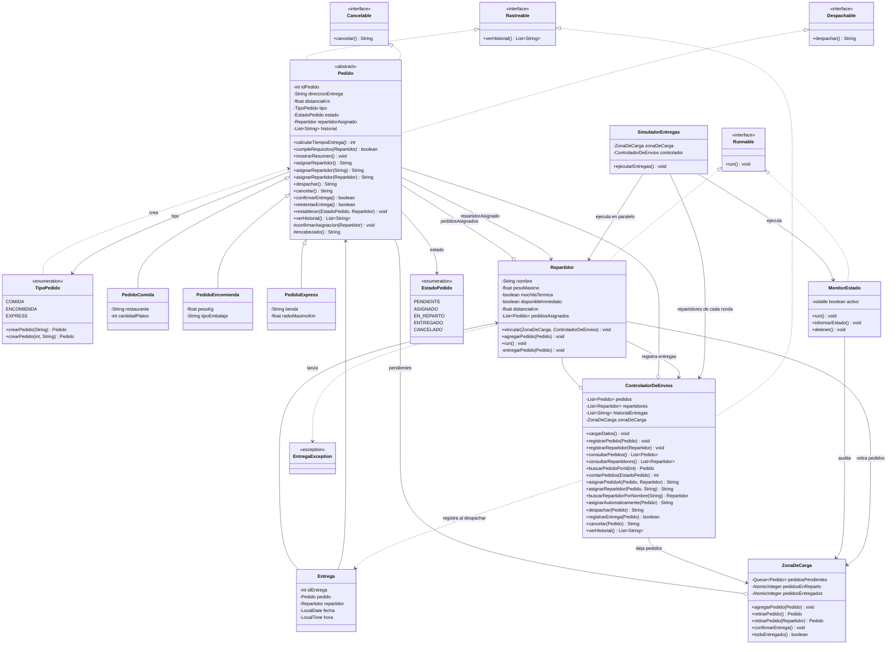
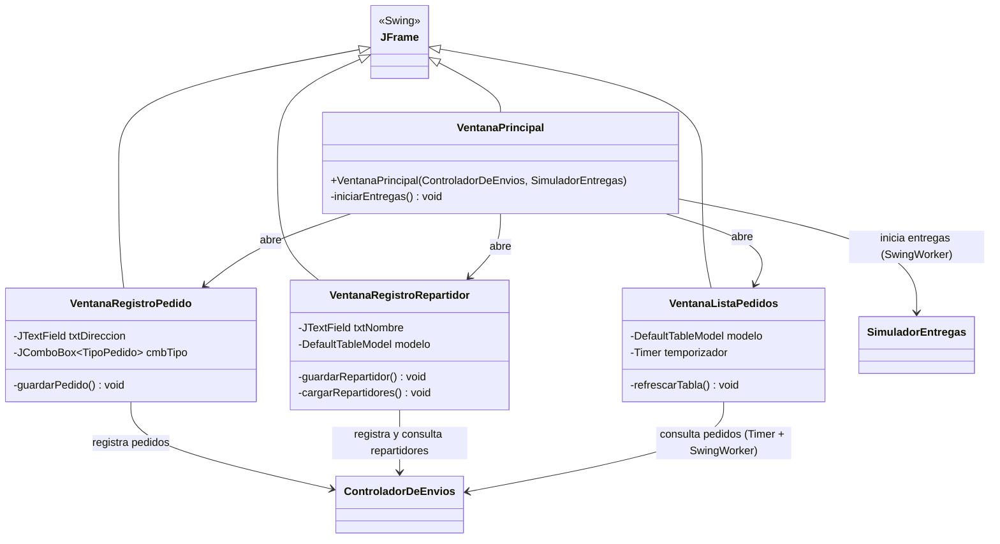
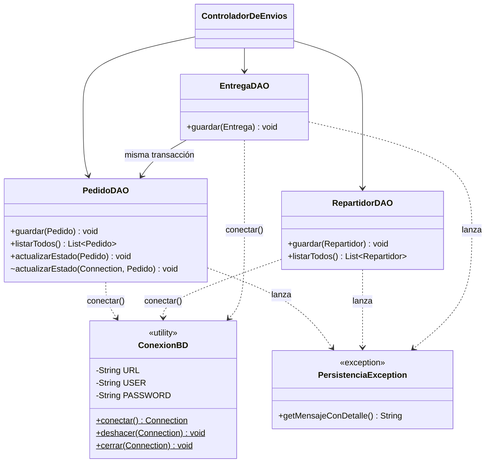
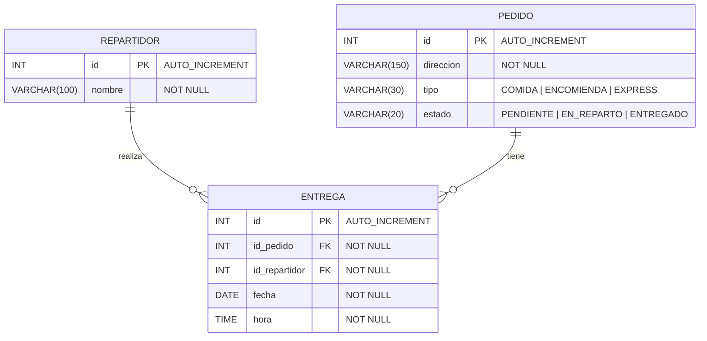

# SpeedFast — Sistema de Gestión de Entregas

## Descripción

SpeedFast es un prototipo de software desarrollado en Java para las actividades formativas y sumativas de la asignatura **Desarrollo Orientado a Objetos II**. Modela la operación de una empresa de reparto a domicilio que ofrece tres tipos de servicio: pedidos de comida de restaurantes, encomiendas (documentos o paquetes) y compras express en supermercado o farmacia.

El proyecto se construye de forma incremental:

* **Semana 1 — "Explorando la sobrecarga y sobreescritura en clases derivadas"**: jerarquía de pedidos y método `asignarRepartidor()` sobrecargado y sobrescrito según el tipo de servicio.
* **Semana 2 — "Definiendo una clase abstracta y su jerarquía"**: `Pedido` se convierte en **clase abstracta**, se incorpora el atributo común `distanciaKm`, el método implementado `mostrarResumen()` y el método abstracto `calcularTiempoEntrega()`.
* **Semana 3 — "Diseñando un sistema orientado a objetos con clases abstractas, polimorfismo e interfaces"**: se incorporan las interfaces `Despachable`, `Cancelable` y `Rastreable`, el estado del pedido, y la clase `ControladorDeEnvios`, que concentra la lógica de gestión sobre colecciones dinámicas (`ArrayList`).
* **Semana 4 — "Ejecutando tareas en paralelo con hilos en Java"**: `Repartidor` implementa `Runnable` y cada repartidor pasa a ejecutarse como un hilo independiente que recorre su propia lista de pedidos. `Main` lanza a todos los repartidores en paralelo con `ExecutorService`, y el acceso al historial compartido se protege con `synchronized`.
* **Semana 5 — "Sincronizando procesos en sistemas concurrentes"**: los pedidos dejan de repartirse de antemano y pasan a una `ZonaDeCarga` compartida, desde la cual los repartidores los retiran de a uno compitiendo entre sí. La sincronización garantiza que cada pedido sea retirado y entregado por un único repartidor, y un `MonitorEstado` audita el sistema en tiempo real.
* **Semana 6 — "Diseñando interfaces gráficas para aplicaciones en Java"**: el sistema incorpora una interfaz de escritorio construida con **Java Swing**. Desde una `VentanaPrincipal` se abre un formulario para registrar pedidos con validación de campos, un listado de pedidos en `JTable`, y se inician las entregas concurrentes sin bloquear el hilo gráfico.
* **Semana 7 — "Conectando aplicaciones Java con bases de datos mediante JDBC"**: pedidos, repartidores y entregas pasan a guardarse en una base de datos **MySQL** mediante **JDBC**. Una capa `dao` (`ConexionBD`, `PedidoDAO`, `RepartidorDAO` y `EntregaDAO`) concentra el acceso a datos: los formularios registran pedidos y repartidores directamente en la base de datos, y el listado `JTable` consulta los pedidos almacenados y se actualiza solo mientras avanzan las entregas.

> El proyecto se mantiene como un único proyecto Maven en la raíz del repositorio: cada semana se construye sobre la anterior, y el avance semanal queda registrado en los commits en lugar de duplicar el código en carpetas separadas.

Cada tipo de pedido tiene criterios distintos, tanto para asignar repartidor como para estimar su tiempo de entrega:

* **Comida** — requiere un repartidor con mochila térmica.
* **Encomienda** — requiere validar el peso del bulto y su embalaje.
* **Compra express** — debe asignarse al repartidor más cercano con disponibilidad inmediata.

El sistema aplica los principios fundamentales de la Programación Orientada a Objetos:

* **Abstracción** — `Pedido` es una clase abstracta: reúne lo común a todo pedido y no puede instanciarse por sí sola, ya que un "pedido genérico" no existe en el dominio.
* **Encapsulamiento** — todos los atributos son `private` y se acceden mediante getters y setters públicos. El estado del pedido solo cambia a través de sus propias operaciones.
* **Herencia** — jerarquía `Pedido → PedidoComida / PedidoEncomienda / PedidoExpress`, donde la clase base concentra los atributos y el comportamiento común. Cada ventana de la interfaz hereda de `JFrame`.
* **Métodos abstractos** — `calcularTiempoEntrega()` y `cumpleRequisitos()` se declaran sin cuerpo en la clase base y obligan a cada subclase a definir su propia regla.
* **Sobrescritura (*overriding*)** — cada subclase redefine `asignarRepartidor()`, `calcularTiempoEntrega()` y `cumpleRequisitos()` con `@Override`.
* **Sobrecarga (*overloading*)** — el método `asignarRepartidor()` existe en tres firmas distintas: sin parámetros, con el nombre del repartidor (`String`) y con el objeto `Repartidor` completo.
* **Interfaces** — `Despachable`, `Cancelable` y `Rastreable` desacoplan las operaciones de despacho, cancelación y seguimiento de la jerarquía de pedidos.
* **Polimorfismo** — el `ControladorDeEnvios` trabaja con referencias `Pedido` y con listas `List<Pedido>`, sin conocer el tipo concreto de cada objeto. El formulario y `PedidoDAO` crean un `PedidoComida`, `PedidoEncomienda` o `PedidoExpress` según el `TipoPedido`, y el controlador lo registra simplemente como `Pedido`.
* **Colecciones dinámicas** — el controlador administra `ArrayList` de pedidos, repartidores e historial de entregas.
* **Separación de responsabilidades (MVC + DAO)** — el modelo no conoce la interfaz ni JDBC; las ventanas solo disparan operaciones del `ControladorDeEnvios` y muestran sus datos; el controlador delega la persistencia en los DAO; `Main` solo arma el sistema y abre la ventana principal.
* **Persistencia (JDBC)** — `ConexionBD` abre las conexiones con `DriverManager`; los DAO ejecutan sentencias `PreparedStatement` y leen los resultados con `ResultSet`. Toda conexión se cierra al terminar, con *try-with-resources* o en un bloque `finally`.
* **Patrón DAO** — cada tabla tiene su propia clase de acceso a datos, de modo que el SQL no se mezcla con la lógica de negocio ni con la interfaz.
* **Concurrencia** — `Repartidor` implementa `Runnable` y se ejecuta en paralelo mediante `ExecutorService`, con pausas aleatorias que simulan cada entrega.
* **Recurso compartido** — la `ZonaDeCarga` es accedida simultáneamente por los tres hilos de repartidor; sus métodos `synchronized` garantizan que cada pedido sea retirado por un único repartidor.
* **Sincronización** — `synchronized` protege las secciones críticas, `AtomicInteger` lleva los contadores sin bloqueo y `volatile` comunica la orden de detención al monitor.
* **Manejo de excepciones** — `EntregaException` e `InterruptedException` se capturan por pedido, de modo que un fallo no detiene el recorrido completo. Los DAO envuelven cada `SQLException` en una `PersistenciaException` con un mensaje comprensible. En la interfaz, los datos inválidos y los errores de base de datos se informan con `JOptionPane` sin cerrar el formulario.

---

## Estructura del proyecto

```text
speedfast/
├── sql/
│   ├── 01_crear_base_datos.sql         # Base speedfast_db, tablas del modelo y verificación de claves foráneas
│   └── 02_datos_ejemplo.sql            # Repartidores y pedidos de ejemplo (opcional)
├── src/main/java/com/speedfast/
│   ├── main/
│   │   └── Main.java                   # Arma el sistema, carga los datos y abre la ventana principal
│   ├── model/
│   │   ├── Pedido.java                 # Clase abstracta; implementa las 3 interfaces
│   │   ├── PedidoComida.java           # Mochila térmica · 15 min + 2 min/km
│   │   ├── PedidoEncomienda.java       # Peso y embalaje · 20 min + 1,5 min/km
│   │   ├── PedidoExpress.java          # Cercanía y disponibilidad · 10 min (+5 si > 5 km)
│   │   ├── TipoPedido.java             # Enum: comida, encomienda, express; crea cada subclase
│   │   ├── Repartidor.java             # Implementa Runnable: retira y entrega pedidos en un hilo
│   │   ├── Entrega.java                # Relación pedido–repartidor con fecha y hora
│   │   ├── EstadoPedido.java           # Enum: pendiente, asignado, en reparto, entregado, cancelado
│   │   ├── Despachable.java            # Interfaz: despachar()
│   │   ├── Cancelable.java             # Interfaz: cancelar()
│   │   └── Rastreable.java             # Interfaz: verHistorial()
│   ├── dao/
│   │   ├── ConexionBD.java             # Conexión JDBC con DriverManager
│   │   ├── PedidoDAO.java              # guardar(), listarTodos() y actualizarEstado() de pedidos
│   │   ├── RepartidorDAO.java          # guardar() y listarTodos() de repartidores
│   │   └── EntregaDAO.java             # guardar() de entregas, en una transacción
│   ├── exception/
│   │   ├── EntregaException.java       # Error de dominio al entregar un pedido
│   │   └── PersistenciaException.java  # Error al operar con la base de datos
│   ├── service/
│   │   ├── ControladorDeEnvios.java    # Controlador compartido por todas las ventanas; usa los DAO
│   │   ├── ZonaDeCarga.java            # Recurso compartido: retiro sincronizado de pedidos
│   │   ├── SimuladorEntregas.java      # Ciclo de vida de los hilos de cada ronda de entregas
│   │   └── MonitorEstado.java          # Hilo que audita el sistema en tiempo real
│   └── view/
│       ├── VentanaPrincipal.java           # Botones de navegación e inicio de entregas
│       ├── VentanaRegistroPedido.java      # Formulario de registro de pedidos
│       ├── VentanaRegistroRepartidor.java  # Formulario de registro de repartidores y su listado
│       └── VentanaListaPedidos.java        # Listado de pedidos en JTable, actualizado automáticamente
├── src/main/resources/images/          # Evidencias de ejecución
├── pom.xml                             # Incluye la dependencia mysql-connector-j
└── README.md
```

---

## Diagrama de clases

### Dominio y servicios


```mermaid
classDiagram
    class Despachable {
        <<interface>>
        +despachar() String
    }
    class Cancelable {
        <<interface>>
        +cancelar() String
    }
    class Rastreable {
        <<interface>>
        +verHistorial() List~String~
    }

    class Pedido {
        <<abstract>>
        -int idPedido
        -String direccionEntrega
        -float distanciaKm
        -TipoPedido tipo
        -EstadoPedido estado
        -Repartidor repartidorAsignado
        -List~String~ historial
        +calcularTiempoEntrega()* int
        +cumpleRequisitos(Repartidor)* boolean
        +mostrarResumen() void
        +asignarRepartidor() String
        +asignarRepartidor(String) String
        +asignarRepartidor(Repartidor) String
        +despachar() String
        +cancelar() String
        +confirmarEntrega() boolean
        +reintentarEntrega() boolean
        +restablecer(EstadoPedido, Repartidor) void
        +verHistorial() List~String~
        #confirmarAsignacion(Repartidor) void
        #encabezado() String
    }

    class TipoPedido {
        <<enumeration>>
        COMIDA
        ENCOMIENDA
        EXPRESS
        +crearPedido(String) Pedido
        +crearPedido(int, String) Pedido
    }

    class Entrega {
        -int idEntrega
        -Pedido pedido
        -Repartidor repartidor
        -LocalDate fecha
        -LocalTime hora
    }

    class PedidoComida {
        -String restaurante
        -int cantidadPlatos
    }
    class PedidoEncomienda {
        -float pesoKg
        -String tipoEmbalaje
    }
    class PedidoExpress {
        -String tienda
        -float radioMaximoKm
    }

    class ControladorDeEnvios {
        -List~Pedido~ pedidos
        -List~Repartidor~ repartidores
        -List~String~ historialEntregas
        -ZonaDeCarga zonaDeCarga
        +cargarDatos() void
        +registrarPedido(Pedido) void
        +registrarRepartidor(Repartidor) void
        +consultarPedidos() List~Pedido~
        +consultarRepartidores() List~Repartidor~
        +buscarPedidoPorId(int) Pedido
        +contarPedidos(EstadoPedido) int
        +asignarPedidoA(Pedido, Repartidor) String
        +asignarRepartidor(Pedido, String) String
        +buscarRepartidorPorNombre(String) Repartidor
        +asignarAutomaticamente(Pedido) String
        +despachar(Pedido) String
        +registrarEntrega(Pedido) boolean
        +cancelar(Pedido) String
        +verHistorial() List~String~
    }

    class Runnable {
        <<interface>>
        +run() void
    }

    class ZonaDeCarga {
        -Queue~Pedido~ pedidosPendientes
        -AtomicInteger pedidosEnReparto
        -AtomicInteger pedidosEntregados
        +agregarPedido(Pedido) void
        +retirarPedido() Pedido
        +retirarPedido(Repartidor) Pedido
        +confirmarEntrega() void
        +todoEntregado() boolean
    }

    class SimuladorEntregas {
        -ZonaDeCarga zonaDeCarga
        -ControladorDeEnvios controlador
        +ejecutarEntregas() void
    }

    class MonitorEstado {
        -volatile boolean activo
        +run() void
        +informarEstado() void
        +detener() void
    }

    class Repartidor {
        -String nombre
        -float pesoMaximo
        -boolean mochilaTermica
        -boolean disponibleInmediato
        -float distanciaKm
        -List~Pedido~ pedidosAsignados
        +vincular(ZonaDeCarga, ControladorDeEnvios) void
        +agregarPedido(Pedido) void
        +run() void
        -entregarPedido(Pedido) void
    }

    class EstadoPedido {
        <<enumeration>>
        PENDIENTE
        ASIGNADO
        EN_REPARTO
        ENTREGADO
        CANCELADO
    }

    class EntregaException {
        <<exception>>
    }

    Despachable <|.. Pedido
    Cancelable <|.. Pedido
    Rastreable <|.. Pedido
    Rastreable <|.. ControladorDeEnvios
    Runnable <|.. Repartidor
    Runnable <|.. MonitorEstado
    Repartidor --> ZonaDeCarga : retira pedidos
    MonitorEstado --> ZonaDeCarga : audita
    ZonaDeCarga o-- Pedido : pendientes
    ControladorDeEnvios --> ZonaDeCarga : deja pedidos
    SimuladorEntregas --> Repartidor : ejecuta en paralelo
    SimuladorEntregas --> MonitorEstado : ejecuta
    SimuladorEntregas --> ControladorDeEnvios : repartidores de cada ronda
    Pedido <|-- PedidoComida
    Pedido <|-- PedidoEncomienda
    Pedido <|-- PedidoExpress
    Pedido --> Repartidor : repartidorAsignado
    Pedido --> EstadoPedido : estado
    Pedido --> TipoPedido : tipo
    TipoPedido ..> Pedido : crea
    Entrega --> Pedido
    Entrega --> Repartidor
    ControladorDeEnvios ..> Entrega : registra al despachar
    Repartidor o-- Pedido : pedidosAsignados
    Repartidor ..> EntregaException : lanza
    Repartidor --> ControladorDeEnvios : registra entregas
    ControladorDeEnvios o-- Pedido
    ControladorDeEnvios o-- Repartidor
```

### Interfaz gráfica


```mermaid
classDiagram
    class JFrame {
        <<Swing>>
    }
    class VentanaPrincipal {
        +VentanaPrincipal(ControladorDeEnvios, SimuladorEntregas)
        -iniciarEntregas() void
    }
    class VentanaRegistroPedido {
        -JTextField txtDireccion
        -JComboBox~TipoPedido~ cmbTipo
        -guardarPedido() void
    }
    class VentanaRegistroRepartidor {
        -JTextField txtNombre
        -DefaultTableModel modelo
        -guardarRepartidor() void
        -cargarRepartidores() void
    }
    class VentanaListaPedidos {
        -DefaultTableModel modelo
        -Timer temporizador
        -refrescarTabla() void
    }

    JFrame <|-- VentanaPrincipal
    JFrame <|-- VentanaRegistroPedido
    JFrame <|-- VentanaRegistroRepartidor
    JFrame <|-- VentanaListaPedidos
    VentanaPrincipal --> VentanaRegistroPedido : abre
    VentanaPrincipal --> VentanaRegistroRepartidor : abre
    VentanaPrincipal --> VentanaListaPedidos : abre
    VentanaPrincipal --> SimuladorEntregas : inicia entregas (SwingWorker)
    VentanaRegistroPedido --> ControladorDeEnvios : registra pedidos
    VentanaRegistroRepartidor --> ControladorDeEnvios : registra y consulta repartidores
    VentanaListaPedidos --> ControladorDeEnvios : consulta pedidos (Timer + SwingWorker)
```

### Persistencia (DAO)


```mermaid
classDiagram
    class ConexionBD {
        <<utility>>
        -String URL
        -String USER
        -String PASSWORD
        +conectar()$ Connection
        +deshacer(Connection)$ void
        +cerrar(Connection)$ void
    }
    class PedidoDAO {
        +guardar(Pedido) void
        +listarTodos() List~Pedido~
        +actualizarEstado(Pedido) void
        ~actualizarEstado(Connection, Pedido) void
    }
    class RepartidorDAO {
        +guardar(Repartidor) void
        +listarTodos() List~Repartidor~
    }
    class EntregaDAO {
        +guardar(Entrega) void
    }
    class PersistenciaException {
        <<exception>>
        +getMensajeConDetalle() String
    }

    ControladorDeEnvios --> PedidoDAO
    ControladorDeEnvios --> RepartidorDAO
    ControladorDeEnvios --> EntregaDAO
    PedidoDAO ..> ConexionBD : conectar()
    RepartidorDAO ..> ConexionBD : conectar()
    EntregaDAO ..> ConexionBD : conectar()
    EntregaDAO --> PedidoDAO : misma transacción
    PedidoDAO ..> PersistenciaException : lanza
    RepartidorDAO ..> PersistenciaException : lanza
    EntregaDAO ..> PersistenciaException : lanza
```

---

## Clases principales

* **`Pedido`** *(abstracta)* — atributos comunes: `idPedido`, `direccionEntrega`, `distanciaKm`, `tipo`, `estado`, `repartidorAsignado` e `historial`. Implementa las tres interfaces y ofrece `mostrarResumen()`, `confirmarAsignacion()` y `encabezado()` como comportamiento reutilizable. `reintentarEntrega()` devuelve a pendiente un pedido cuya entrega quedó interrumpida, y `restablecer()` permite a `PedidoDAO` reconstruir el estado guardado en la base de datos.
* **`TipoPedido`** — enumeración con los tres tipos de servicio. El nombre de cada constante es el valor de la columna `tipo`, y su método `crearPedido()` crea la subclase correspondiente con valores estándar para los datos que la tabla no guarda (distancia, peso, tienda, etc.).
* **`PedidoComida`** — agrega `restaurante` y `cantidadPlatos`. Solo acepta repartidores con **mochila térmica**.
* **`PedidoEncomienda`** — agrega `pesoKg` y `tipoEmbalaje`. Valida la **capacidad de carga** del repartidor y que el **embalaje** esté declarado.
* **`PedidoExpress`** — agrega `tienda` y `radioMaximoKm`. Exige **disponibilidad inmediata** y **cercanía** dentro del radio de cobertura.
* **`Repartidor`** — datos del repartidor (`pesoMaximo`, `mochilaTermica`, `disponibleInmediato`, `distanciaKm`), que son los atributos que permiten validar cada tipo de pedido. Implementa `Runnable`: su método `run()` retira pedidos de la `ZonaDeCarga` mientras queden compatibles con su perfil, y los entrega simulando el traslado con pausas aleatorias. El constructor `Repartidor(id, nombre)` crea un repartidor a partir de lo que guarda la tabla, con un perfil estándar; `vincular()` le asigna la zona de carga y el controlador al incorporarlo a la operación.
* **`Entrega`** — relaciona un pedido con el repartidor que lo lleva, junto a la fecha y hora en que salió a reparto. Corresponde a la tabla `entrega`.
* **`ZonaDeCarga`** — recurso compartido donde llegan los pedidos. Sus métodos `agregarPedido()` y `retirarPedido()` son `synchronized`, lo que impide que dos repartidores retiren el mismo pedido. Lleva contadores `AtomicInteger` de pedidos en reparto y entregados.
* **`MonitorEstado`** — hilo que informa periódicamente cuántos pedidos hay pendientes, en reparto y entregados. Consulta solo los contadores atómicos, por lo que audita el sistema sin interferir con el trabajo de los repartidores.
* **`SimuladorEntregas`** — ejecuta una ronda de entregas: lanza a los repartidores con `ExecutorService` y al monitor en su propio hilo, espera el término de todos y cierra el monitor con `join()`.
* **`EstadoPedido`** — enumeración con los estados válidos de un pedido, evitando textos sueltos repartidos por el código.
* **`EntregaException`** — excepción de dominio que permite informar por qué falló una entrega sin interrumpir el recorrido completo del repartidor.
* **`PersistenciaException`** — excepción que lanzan los DAO cuando una operación con la base de datos falla. Envuelve la `SQLException` original, de modo que el controlador y las ventanas informan el problema sin depender de JDBC.
* **`ControladorDeEnvios`** — registra pedidos y repartidores, asigna, despacha, cancela y mantiene el historial de entregas. Es el controlador que comparten todas las ventanas: cada cambio lo guarda en la base de datos por medio de los DAO, y mantiene en memoria los pedidos y repartidores con los que trabajan los hilos. Protege sus listas con `synchronized` porque varios hilos de repartidor lo utilizan al mismo tiempo.
* **DAO (`dao`)** — `ConexionBD`, `PedidoDAO`, `RepartidorDAO` y `EntregaDAO`, descritos en la sección [Persistencia con JDBC](#persistencia-con-jdbc-semana-7).
* **Ventanas (`view`)** — `VentanaPrincipal`, `VentanaRegistroPedido`, `VentanaRegistroRepartidor` y `VentanaListaPedidos`, descritas en la sección [Interfaz gráfica](#interfaz-gráfica-semanas-6-y-7).

### Interfaces implementadas

| Interfaz | Método | Implementada por | Propósito |
|---|---|---|---|
| `Despachable` | `despachar()` | `PedidoComida`, `PedidoEncomienda`, `PedidoExpress` (heredado de `Pedido`) | Enviar el pedido a reparto validando su estado |
| `Cancelable` | `cancelar()` | `PedidoComida`, `PedidoEncomienda`, `PedidoExpress` (heredado de `Pedido`) | Anular un pedido que aún no ha sido despachado |
| `Rastreable` | `verHistorial()` | `Pedido` y `ControladorDeEnvios` | Consultar el avance: eventos del pedido e historial global del sistema |

### Método abstracto `calcularTiempoEntrega()`

| Subclase | Fórmula | Ejemplo |
|---|---|---|
| `PedidoComida` | 15 min base + 2 min por kilómetro | 4 km → **23 minutos** |
| `PedidoEncomienda` | 20 min base + 1,5 min por kilómetro (redondeado a entero) | 6 km → **29 minutos** |
| `PedidoExpress` | 10 min base, +5 min si la distancia supera los 5 km | 7 km → **15 minutos** |

### Método abstracto `cumpleRequisitos(Repartidor)`

Permite que el `ControladorDeEnvios` busque un repartidor adecuado **sin conocer las reglas de cada tipo de pedido**: se las pregunta al propio pedido.

| Subclase | Requisito |
|---|---|
| `PedidoComida` | El repartidor cuenta con mochila térmica |
| `PedidoEncomienda` | La carga no supera la capacidad del repartidor y hay embalaje declarado |
| `PedidoExpress` | El repartidor tiene disponibilidad inmediata y está dentro del radio de cobertura |

### Sobrecarga del método `asignarRepartidor()`

| Firma | Comportamiento |
|---|---|
| `asignarRepartidor()` | Mensaje genérico: aún no se designa a nadie |
| `asignarRepartidor(String nombreRepartidor)` | Registra el candidato en el historial del pedido y advierte que la asignación aún no se confirma: sin el objeto no es posible validar los requisitos |
| `asignarRepartidor(Repartidor repartidor)` | Valida los requisitos del tipo de pedido y, si se cumplen, registra la asignación |

Para asignar por nombre de forma efectiva se usa `ControladorDeEnvios.asignarRepartidor(pedido, nombre)`: el controlador es quien conoce la lista de repartidores, resuelve el nombre y delega en la versión que sí valida. Así el mensaje mostrado en consola nunca afirma algo que el estado del objeto no refleje.

---

## Persistencia con JDBC (Semana 7)

### Modelo de datos


```mermaid
erDiagram
    REPARTIDOR ||--o{ ENTREGA : realiza
    PEDIDO ||--o{ ENTREGA : tiene
    REPARTIDOR {
        INT id PK "AUTO_INCREMENT"
        VARCHAR(100) nombre "NOT NULL"
    }
    PEDIDO {
        INT id PK "AUTO_INCREMENT"
        VARCHAR(150) direccion "NOT NULL"
        VARCHAR(30) tipo "COMIDA | ENCOMIENDA | EXPRESS"
        VARCHAR(20) estado "PENDIENTE | EN_REPARTO | ENTREGADO"
    }
    ENTREGA {
        INT id PK "AUTO_INCREMENT"
        INT id_pedido FK "NOT NULL"
        INT id_repartidor FK "NOT NULL"
        DATE fecha "NOT NULL"
        TIME hora "NOT NULL"
    }
```

* Un **repartidor** puede realizar **muchas entregas**.
* Un **pedido** puede tener **una o varias entregas**: cada entrega es un intento. Si un intento queda interrumpido, el pedido vuelve a la zona de carga y se registra un nuevo intento al retirarlo otra vez.
* Cada **entrega** se asocia a un **pedido** y a un **repartidor** mediante claves foráneas.

### Paso 1: configuración de la base de datos

La carpeta `sql/` contiene dos scripts, que se ejecutan en MySQL Workbench (*File → Open SQL Script* y luego *Execute*) o por consola:

```bash
mysql -u root -p < sql/01_crear_base_datos.sql
mysql -u root -p < sql/02_datos_ejemplo.sql
```

| Script | Contenido |
|---|---|
| `01_crear_base_datos.sql` | Crea la base `speedfast_db` y las tablas `repartidor`, `pedido` y `entrega` tal como las define el modelo. Al final, una consulta a `information_schema.KEY_COLUMN_USAGE` verifica que las dos claves foráneas de `entrega` se hayan creado |
| `02_datos_ejemplo.sql` | *(Opcional)* Tres repartidores y seis pedidos pendientes, para que la aplicación no parta vacía |

El resultado esperado de la verificación es:

```text
+------------+---------------+-----------------+-----------------------+------------------------+
| TABLE_NAME | COLUMN_NAME   | CONSTRAINT_NAME | REFERENCED_TABLE_NAME | REFERENCED_COLUMN_NAME |
+------------+---------------+-----------------+-----------------------+------------------------+
| entrega    | id_pedido     | entrega_ibfk_1  | pedido                | id                     |
| entrega    | id_repartidor | entrega_ibfk_2  | repartidor            | id                     |
+------------+---------------+-----------------+-----------------------+------------------------+
```

> El script de las instrucciones crea la base `speedfast` pero luego ejecuta `USE speedfast_db`, y su última parte (la segunda clave foránea y el cierre de la tabla `entrega`) queda cortada entre páginas. Aquí se usa `speedfast_db` en todo el script, que es el nombre que indica el Paso 1 y la URL de conexión del ejemplo, y se completa la clave foránea hacia `repartidor` que exige la relación del modelo.

### Paso 2: conexión JDBC

El driver se agrega al proyecto como dependencia de Maven en el `pom.xml` (`com.mysql:mysql-connector-j:9.7.0`, compatible con MySQL Server 8.0 y posteriores). Al abrir el proyecto, IntelliJ IDEA la descarga y la agrega al classpath, sin necesidad de configurar el *jar* a mano. Desde JDBC 4 el driver se registra solo, por lo que no hace falta `Class.forName()`.

`ConexionBD` gestiona la conexión con `DriverManager`, siguiendo el ejemplo de las instrucciones:

| Parámetro | Valor por defecto | Variable de entorno que lo reemplaza |
|---|---|---|
| `URL` | `jdbc:mysql://localhost:3306/speedfast_db` | `SPEEDFAST_DB_URL` |
| `USER` | `root` | `SPEEDFAST_DB_USER` |
| `PASSWORD` | `contraseña_de_ejemplo` | `SPEEDFAST_DB_PASSWORD` |

La contraseña puede escribirse directamente en la constante `PASSWORD` o, de preferencia, definirse como variable de entorno: así la contraseña real no queda en el código ni se sube a GitHub. En IntelliJ IDEA se define en *Run → Edit Configurations… → Environment variables*.

### Paso 3: operaciones de los DAO

| DAO | Método | Sentencia SQL | JDBC |
|---|---|---|---|
| `PedidoDAO` | `guardar(Pedido)` | `INSERT INTO pedido (direccion, tipo, estado) VALUES (?, ?, ?)` | `PreparedStatement` + `getGeneratedKeys()` |
| `PedidoDAO` | `listarTodos()` | `SELECT` de `pedido` unido con su última `entrega` y su `repartidor` (`LEFT JOIN`) | `PreparedStatement` + `ResultSet` |
| `PedidoDAO` | `actualizarEstado(Pedido)` | `UPDATE pedido SET estado = ? WHERE id = ?` | `PreparedStatement` |
| `RepartidorDAO` | `guardar(Repartidor)` | `INSERT INTO repartidor (nombre) VALUES (?)` | `PreparedStatement` + `getGeneratedKeys()` |
| `RepartidorDAO` | `listarTodos()` | `SELECT id, nombre FROM repartidor ORDER BY id` | `PreparedStatement` + `ResultSet` → `List<Repartidor>` |
| `EntregaDAO` | `guardar(Entrega)` | `INSERT INTO entrega (id_pedido, id_repartidor, fecha, hora) VALUES (?, ?, ?, ?)` y `UPDATE` del estado del pedido, en una transacción | `setAutoCommit(false)`, `commit()` y `rollback()` |

Todas las sentencias usan `PreparedStatement`: los valores viajan como parámetros y no concatenados en el SQL, lo que evita la inyección SQL y los errores con caracteres especiales en las direcciones.

### Paso 4: flujo de los datos entre la interfaz y la base de datos

Las ventanas siguen trabajando solo con `ControladorDeEnvios`, que delega en los DAO. Ninguna ventana contiene SQL ni conoce JDBC.

| Momento | Operación en la base de datos |
|---|---|
| Inicio de la aplicación | `RepartidorDAO.listarTodos()` y `PedidoDAO.listarTodos()`: los pedidos pendientes pasan a la zona de carga |
| **Guardar** en *Registrar pedido* | `PedidoDAO.guardar()`: la base de datos asigna el ID, que se informa al usuario |
| **Guardar** en *Registrar repartidor* | `RepartidorDAO.guardar()`, y la tabla de la ventana se recarga con `listarTodos()` |
| *Listar pedidos* | `PedidoDAO.listarTodos()` cada segundo, mientras la ventana está abierta |
| Un repartidor retira un pedido y sale a reparto | `EntregaDAO.guardar()`: nueva fila en `entrega` y pedido en `EN_REPARTO` |
| El repartidor confirma la entrega | `PedidoDAO.actualizarEstado()`: pedido en `ENTREGADO` |

Como los formularios guardan directamente en la base de datos, un pedido o repartidor registrado desde la interfaz sigue disponible al volver a abrir la aplicación, y también aparece en MySQL Workbench.

### Manejo de excepciones y cierre de recursos

| Situación | Tratamiento |
|---|---|
| Operación simple (un `INSERT`, `SELECT` o `UPDATE`) | *try-with-resources*: `Connection`, `PreparedStatement` y `ResultSet` se cierran solos al salir del bloque, incluso si ocurre un error. Es la forma moderna del bloque `finally` que cierra los recursos |
| Registro de una entrega (dos sentencias) | `try-catch-finally` explícito: `commit()` si ambas sentencias funcionan, `rollback()` en el `catch` si alguna falla, y `ConexionBD.cerrar()` en el `finally` en ambos casos |
| `SQLException` en un DAO | Se envuelve en una `PersistenciaException` que describe la operación ("No fue posible guardar el pedido…") y conserva la causa original |
| Error al guardar desde un formulario | Se informa con `JOptionPane` junto al detalle de MySQL; el pedido o repartidor no se agrega a la simulación |
| Error de conexión al iniciar | Se informa con `JOptionPane` indicando la URL y qué revisar (servidor en ejecución, base creada, credenciales), y la aplicación se cierra |
| Error de conexión con el listado abierto | La etiqueta inferior informa la falta de conexión, sin abrir un diálogo cada segundo, y la tabla vuelve a actualizarse cuando la conexión se recupera |
| Error de base de datos durante una entrega | El repartidor informa el error por consola y continúa con el siguiente pedido |
| Fila con un tipo o estado no reconocido | `PedidoDAO` lanza una `PersistenciaException` que indica el valor inválido. Los valores en minúsculas escritos a mano en Workbench sí se aceptan |

### Decisiones de diseño

* **El esquema es exactamente el del modelo.** No se agregaron columnas, de modo que el proyecto funciona sobre cualquier base creada con el script de las instrucciones. Como la tabla `repartidor` solo guarda el nombre y `pedido` no guarda los datos propios de cada subclase, esos datos toman valores estándar: `TipoPedido` define los del pedido (3 km, 5 kg, embalaje "Caja", radio de 3 km) y `Repartidor(id, nombre)` define un perfil estándar (motocicleta con mochila térmica, 15 kg, disponible, a 1,5 km). Los valores se eligieron para que cualquier repartidor pueda atender cualquier pedido. Las reglas de `cumpleRequisitos()` se siguen evaluando igual que antes.
* **El ID lo asigna la base de datos.** Las tres tablas usan `AUTO_INCREMENT`, así que el formulario ya no pide el ID. Cada DAO lo obtiene con `getGeneratedKeys()` y lo asigna al objeto recién guardado. Esto además elimina la posibilidad de IDs repetidos.
* **La entrega se registra al salir a reparto.** En ese momento se conoce la relación entre pedido y repartidor, así que el listado puede mostrar quién lleva cada pedido mientras va en camino. La inserción de la entrega y el cambio de estado del pedido ocurren en una misma transacción: la base de datos nunca muestra una entrega cuyo pedido no figura en reparto, ni al revés.
* **Recuperación de entregas interrumpidas.** Si la aplicación se cierra durante una ronda, algunos pedidos quedan `EN_REPARTO` en la base de datos. Al iniciar, `cargarDatos()` los devuelve a `PENDIENTE` y a la zona de carga. El intento interrumpido queda registrado en `entrega`, y al entregarlo se registra un segundo intento. Es el caso de "varias entregas por pedido" que contempla el modelo, y el listado muestra siempre al repartidor de la última.
* **Una conexión por operación.** Una `Connection` no es segura para compartirse entre hilos, y los repartidores registran sus entregas en paralelo. Cada operación abre su propia conexión y la cierra al terminar, por lo que los hilos nunca comparten recursos de JDBC.
* **La base de datos se usa fuera de los bloqueos.** En `ControladorDeEnvios`, `synchronized` protege solo las listas en memoria. Las consultas se realizan fuera de esos bloqueos, de modo que ningún repartidor espera a que otro termine de escribir en la base de datos.
* **Los estados `ASIGNADO` y `CANCELADO` existen solo en memoria.** La columna `estado` registra los tres estados del modelo. `ASIGNADO` dura un instante, entre que el repartidor retira el pedido y lo despacha, por lo que no se guarda.

### Mejoras aplicadas a partir de la retroalimentación de la Semana 6

* **Listado sincronizado automáticamente.** `VentanaListaPedidos` usa un `javax.swing.Timer` que vuelve a consultar la base de datos cada segundo, así que los cambios de estado producidos por las entregas aparecen sin presionar **Refrescar** (el botón se mantiene para forzar una recarga). Cada consulta se ejecuta con un `SwingWorker`, fuera del hilo gráfico, y la tabla solo se redibuja si los datos cambiaron. El temporizador se detiene al cerrar la ventana.
* **Comprobación antes de iniciar las entregas.** Si no quedan pedidos pendientes, o no hay repartidores registrados, se informa al usuario en lugar de lanzar una ronda sin trabajo. Al terminar una ronda se informa cuántos pedidos se entregaron *en esa ronda* y cuántos siguen pendientes.
* Tal como se proyectaba en el *feedforward*, las ventanas siguen trabajando con `ControladorDeEnvios` mientras la forma de guardar los datos cambió por debajo. Ninguna lógica de negocio ni sentencia SQL se trasladó a los `JFrame`.

---

## Interfaz gráfica (Semanas 6 y 7)

### Organización en capas (MVC + DAO)

Los paquetes de las capas conservan los nombres en inglés usados desde la Semana 1, y el punto de entrada está en el paquete `main`, como indican las instrucciones. Cada uno cumple un rol del patrón Modelo–Vista–Controlador, y desde la Semana 7 se suma la capa de persistencia:

| Capa | Paquete | Contenido |
|---|---|---|
| Modelo | `model` | `Pedido` y sus subclases, `TipoPedido`, `Repartidor`, `Entrega`, `EstadoPedido` e interfaces del dominio |
| Vista | `view` | `VentanaPrincipal`, `VentanaRegistroPedido`, `VentanaRegistroRepartidor`, `VentanaListaPedidos` |
| Controlador | `service` | `ControladorDeEnvios`, apoyado por `ZonaDeCarga`, `SimuladorEntregas` y `MonitorEstado` |
| Persistencia | `dao` | `ConexionBD`, `PedidoDAO`, `RepartidorDAO` y `EntregaDAO` |
| Punto de entrada | `main` | `Main`, que arma el sistema, carga los datos y abre `new VentanaPrincipal(...)` |

El modelo no importa ninguna clase de Swing ni de JDBC. Las ventanas usan el controlador para registrar y consultar datos, y el simulador para iniciar las entregas. El controlador es el único que usa los DAO.

### Ventanas

| Ventana | Componentes | Función |
|---|---|---|
| `VentanaPrincipal` | `BorderLayout` con un título y cuatro `JButton` en `GridLayout` | Abrir las demás ventanas e iniciar las entregas |
| `VentanaRegistroPedido` | `JTextField` para la dirección, `JComboBox` para el tipo (comida, encomienda, express), botón **Guardar** | Validar los datos, guardar el pedido en la base de datos e informar el ID asignado con `JOptionPane` |
| `VentanaRegistroRepartidor` | `JTextField` para el nombre, botón **Guardar**, `JTable` con los repartidores registrados | Guardar el repartidor en la base de datos y mostrar el listado actualizado desde `RepartidorDAO.listarTodos()` |
| `VentanaListaPedidos` | `JTable` con `DefaultTableModel`, etiqueta de estado, botón **Refrescar** | Mostrar los pedidos guardados con su ID, tipo, dirección, estado y repartidor, actualizándose cada segundo |

Cada botón de la ventana principal abre una ventana nueva, y todas reciben la misma instancia de `ControladorDeEnvios`: un pedido registrado en el formulario aparece en el listado abierto en menos de un segundo, sin presionar **Refrescar**.

El botón **Asignar repartidor / Iniciar entrega** comprueba primero que haya pedidos pendientes y repartidores registrados. Si los hay, lanza a todos los repartidores en paralelo: cada uno retira de la zona de carga los pedidos pendientes que cumplen con su perfil, que quedan así asignados a él, y los entrega. Al terminar se informa cuántos pedidos se entregaron en la ronda, y el listado muestra qué repartidor atendió cada uno.

### Validación de los formularios

| Formulario | Campo | Regla |
|---|---|---|
| Pedido | Dirección | Obligatoria, de hasta 150 caracteres (largo de la columna `direccion`) |
| Pedido | Tipo | Se elige de una lista, por lo que siempre es válido |
| Repartidor | Nombre | Obligatorio, de hasta 100 caracteres (largo de la columna `nombre`) |

Si un dato no es válido se informa el motivo con `JOptionPane` y no se guarda nada. El ID ya no se ingresa: lo asigna la base de datos (`AUTO_INCREMENT`), por lo que no puede repetirse.

El formulario de pedidos solicita solo los datos que guarda la tabla `pedido`. Los demás datos que exige cada subclase (distancia, peso, tienda, etc.) se completan con los valores estándar de `TipoPedido`.

### Hilo gráfico y concurrencia

Swing ejecuta todo el dibujo y los eventos en un único hilo, el *Event Dispatch Thread* (EDT). Si ese hilo esperara a que los repartidores terminen, la ventana quedaría congelada durante toda la ronda. Por eso:

* `Main` carga los datos y crea la ventana principal dentro de `SwingUtilities.invokeLater()`.
* El botón de entregas ejecuta `SimuladorEntregas.ejecutarEntregas()` dentro de un `SwingWorker`, es decir, en un hilo de fondo. Mientras dura la ronda el botón queda deshabilitado; las demás ventanas siguen funcionando, y el listado muestra el avance por sí solo.
* Al terminar, `done()` vuelve al EDT para habilitar el botón y mostrar el resultado.
* El `Timer` del listado se ejecuta en el EDT, pero cada consulta a la base de datos la realiza un `SwingWorker` en segundo plano. Solo la actualización de la tabla vuelve al EDT.

---

## Concurrencia y sincronización (Semanas 4 y 5)

En la Semana 4 cada repartidor recorría una lista de pedidos que se le asignaba de antemano, por lo que en la práctica no competía con nadie. En la Semana 5 los pedidos pasan a una **zona de carga común** y los repartidores los retiran de a uno: recién ahí aparece la competencia real por un recurso compartido, y con ella el riesgo de que dos repartidores tomen el mismo pedido.

| Mecanismo | Uso en el proyecto |
|---|---|
| `Runnable` | Lo implementan `Repartidor` (retira y entrega pedidos) y `MonitorEstado` (informa el avance) |
| `ExecutorService` | `SimuladorEntregas` usa `Executors.newFixedThreadPool()` para lanzar a todos los repartidores registrados en paralelo |
| `shutdown()` + `awaitTermination()` | La ronda continúa hasta que todos los repartidores terminan sus recorridos |
| `join()` | Tras detener al monitor, se espera explícitamente el término de su hilo |
| `Thread.sleep()` | Simula el traslado con una pausa aleatoria de entre 500 y 2000 ms por pedido |
| `synchronized` | Protege `agregarPedido()` y `retirarPedido()` en `ZonaDeCarga`, las transiciones de estado de `Pedido` y las listas y el historial de `ControladorDeEnvios` |
| `AtomicInteger` | Contadores de pedidos en reparto y entregados, que el monitor consulta **sin tomar el bloqueo** |
| `volatile` | Bandera `activo` del `MonitorEstado`: el hilo ve de inmediato la orden de detenerse |
| `SwingWorker` | Ejecuta la ronda de entregas (Semana 6) y las consultas del listado (Semana 7) fuera del hilo gráfico |

### Por qué `retirarPedido()` es la sección crítica

Sin sincronización, dos repartidores podrían consultar la cola en el mismo instante, ver el mismo pedido y retirarlo ambos: el pedido se entregaría dos veces. Al declarar el método `synchronized`, la consulta y la extracción ocurren de forma indivisible, de modo que el segundo repartidor solo entra cuando el primero ya retiró su pedido y este ya no está en la cola.

La cola se recorre con un `Iterator` explícito y el pedido se extrae con `iterator.remove()`, la forma segura de quitar un elemento de una colección mientras se la recorre.

Ninguno de los métodos sincronizados realiza pausas ni consultas a la base de datos. El `Thread.sleep()` ocurre **fuera** del bloqueo, mientras el repartidor viaja, y cada escritura en MySQL usa su propia conexión, también fuera del bloqueo. Por eso los hilos nunca quedan esperando unos por otros y la ejecución se mantiene realmente paralela.

### Mejoras aplicadas a partir de la retroalimentación de la Semana 5

* `retirarPedido(Repartidor)` usaba un *for-each* y eliminaba el pedido con `Queue.remove()`. Ahora usa `Iterator` e `iterator.remove()`, lo que deja la intención explícita y protege el método frente a futuras modificaciones.
* Después de `monitor.detener()` se espera el término del hilo del monitor con `join()`. Aunque el hilo es *daemon* y la bandera `volatile` ya detenía su ciclo, así ningún hilo creado por la aplicación queda activo al cerrar una ronda.
* Tal como se proyectaba en el *feedforward*, `Pedido`, `ZonaDeCarga` y `ControladorDeEnvios` siguen siendo independientes de la presentación: la interfaz solo dispara operaciones y muestra sus resultados, sin bloquear el hilo gráfico.

### Decisiones de diseño

* Se usó `synchronized` en lugar de `ReentrantLock` porque la zona de carga solo necesita exclusión mutua simple; no requiere intentos con tiempo límite ni múltiples condiciones de espera, que son las ventajas que justificarían el lock explícito.
* No se usó `Semaphore`: permitir que varios repartidores accedan a la vez a la zona de carga es precisamente el problema que se debe evitar, y un semáforo de un solo permiso equivaldría a `synchronized`.
* Los contadores del monitor son `AtomicInteger` y no variables protegidas por el mismo bloqueo, para que auditar el sistema no frene a los repartidores.
* Los atributos de `Repartidor` que definen su perfil (`pesoMaximo`, `mochilaTermica`, `tipoVehiculo`, `distanciaKm` y nombre) son `final` y no exponen setters. La zona de carga los consulta desde otro hilo al evaluar `cumpleRequisitos()`, de modo que un atributo inmutable garantiza que la decisión se tome siempre sobre datos estables. `disponibleInmediato` es `volatile`, porque se escribe y se lee bajo bloqueos distintos. El identificador, la zona de carga y el controlador se asignan (con `setIdRepartidor()` y `vincular()`) antes de lanzar el hilo del repartidor. `ExecutorService` garantiza que el hilo vea esos valores, porque todo lo escrito antes de entregarle una tarea es visible para esa tarea.
* El ciclo de vida de los hilos pasó de `Main` a `SimuladorEntregas`, para que las entregas puedan iniciarse desde la interfaz tantas veces como se necesite. Por eso cada repartidor informa al final solo los pedidos entregados en el recorrido actual. Los repartidores se obtienen del controlador al comenzar cada ronda, así que un repartidor registrado desde la interfaz participa desde la siguiente.

### Manejo de excepciones

| Punto crítico | Tratamiento |
|---|---|
| `Thread.sleep()` durante una entrega | Se captura `InterruptedException`, se restaura la marca de interrupción y el repartidor termina de forma controlada |
| Pedido que no puede entregarse | Se lanza `EntregaException` y se captura por pedido: el repartidor informa el motivo y continúa con el siguiente |
| Error de base de datos durante una entrega | Se captura `PersistenciaException` por pedido: el repartidor informa el detalle y continúa con el siguiente |
| Error inesperado dentro del hilo | Un `catch (RuntimeException)` evita que el hilo muera en silencio, ya que `execute()` no propaga las excepciones |
| `awaitTermination()` y `join()` | Se captura `InterruptedException`, se llama a `shutdownNow()` y se restaura la interrupción |
| Repartidor sin pedidos | Se informa por consola en lugar de tratarse como error |
| Dato inválido en el formulario | Se informa con `JOptionPane` y el pedido no se guarda |
| Error durante una ronda iniciada desde la interfaz | `SwingWorker.get()` lo entrega como `ExecutionException` y se informa con `JOptionPane` |

---

## Aporte del diseño a la escalabilidad, reutilización y mantenibilidad

* **Escalabilidad** — agregar un nuevo tipo de servicio (por ejemplo, `PedidoFarmacia`) solo requiere crear una subclase de `Pedido`, implementar sus dos métodos abstractos y sumar una constante a `TipoPedido` con su caso en `crearPedido()`. El `JComboBox` del formulario y `PedidoDAO` la reconocen sin más cambios, y la columna `tipo` ya admite el nuevo valor. `ControladorDeEnvios` no necesita modificarse, porque trabaja con referencias `Pedido`.
* **Reutilización** — el estado, el historial, el despacho, la cancelación y `mostrarResumen()` se escriben una sola vez en la clase abstracta y quedan disponibles para las tres subclases. `encabezado()` evita repetir el formato de los mensajes. `ConexionBD` concentra la apertura y el cierre de conexiones que usan los tres DAO.
* **Mantenibilidad** — cada regla de negocio vive en un solo lugar: las fórmulas de tiempo y los requisitos de asignación están en su subclase, la disponibilidad de repartidores en el controlador, los estados y tipos válidos en los enum `EstadoPedido` y `TipoPedido`, y cada sentencia SQL en el DAO de su tabla. Las interfaces permiten que otras clases usen las operaciones sin depender de la jerarquía concreta. La interfaz gráfica puede cambiar sin tocar el modelo, y la forma de guardar los datos puede cambiar sin tocar las ventanas.

---

## Requisitos

* Java 21 o superior.
* Maven.
* MySQL Server 8.0 o superior (probado con 8.0.34) y, de forma opcional, MySQL Workbench.
* IntelliJ IDEA (recomendado).

El driver JDBC (`mysql-connector-j`) no necesita instalarse: Maven lo descarga a partir del `pom.xml`.

---

## Instrucciones para clonar y ejecutar

1. Clonar el repositorio:

   ```bash
   git clone https://github.com/sara-rioseco/speedfast.git
   cd speedfast
   ```

2. Crear la base de datos con los scripts de la carpeta `sql/`, desde MySQL Workbench o por consola:

   ```bash
   mysql -u root -p < sql/01_crear_base_datos.sql
   mysql -u root -p < sql/02_datos_ejemplo.sql
   ```

3. Indicar la contraseña de MySQL, de una de estas dos formas:
   * Reemplazar el valor de la constante `PASSWORD` en `ConexionBD`.
   * O bien definir la variable de entorno `SPEEDFAST_DB_PASSWORD`. En IntelliJ IDEA se hace en *Run → Edit Configurations… → Environment variables*, y por consola, antes de ejecutar: `$env:SPEEDFAST_DB_PASSWORD="..."` (PowerShell) o `export SPEEDFAST_DB_PASSWORD=...` (bash).

4. Compilar y ejecutar:

   ```bash
   mvn compile
   mvn exec:java -Dexec.mainClass="com.speedfast.main.Main"
   ```

Desde IntelliJ IDEA: abrir el proyecto (IntelliJ descarga el driver al cargar el `pom.xml`) y ejecutar el método `main()` de la clase `Main` (paquete `com.speedfast.main`).

Si la base de datos no está disponible, la aplicación lo informa al iniciar, indicando el motivo que entrega MySQL (servidor detenido, base inexistente o credenciales incorrectas).

### Uso de la aplicación

1. Al iniciar se cargan los datos de `speedfast_db` y se abre la **ventana principal**. Con los datos de ejemplo, el sistema parte con seis pedidos pendientes y tres repartidores: Juan Pérez, Camila Soto y Pedro Díaz.
2. **Registrar pedido** abre el formulario. Al presionar **Guardar** se validan los datos: si hay un error se informa el motivo; si todo es correcto el pedido se guarda en la base de datos y se informa el ID que esta le asignó.
3. **Registrar repartidor** abre el formulario de repartidores, con el listado de los ya registrados. El repartidor nuevo se guarda en la base de datos y participa desde la próxima ronda.
4. **Listar pedidos** muestra los pedidos guardados en la base de datos. La tabla se actualiza sola cada segundo; el botón **Refrescar** fuerza una recarga inmediata.
5. **Asignar repartidor / Iniciar entrega** lanza a los repartidores en paralelo, siempre que haya pedidos pendientes. Con el listado abierto se ve a cada pedido pasar de `PENDIENTE` a `EN_REPARTO` y a `ENTREGADO`, junto al repartidor que lo lleva. Al terminar se informa cuántos pedidos se entregaron en la ronda.
6. Todo queda guardado: al cerrar y volver a abrir la aplicación, los pedidos conservan su estado, y las tablas `pedido`, `repartidor` y `entrega` pueden consultarse en MySQL Workbench.
7. La consola sigue mostrando los mensajes de los repartidores y del monitor, que evidencian la ejecución concurrente:

```text
Pedido #1 agregado. Destino: Santiago Centro
...
[Repartidor - Juan Pérez] Retirando pedido #1... Destino: Santiago Centro
[Repartidor - Camila Soto] Retirando pedido #2... Destino: Providencia
[Repartidor - Pedro Díaz] Retirando pedido #3... Destino: Ñuñoa
[Repartidor - Juan Pérez] Estado: EN_REPARTO
[Repartidor - Juan Pérez] Entregando pedido #1... (21 min estimados)
   [Monitor] Pendientes: 3 | En reparto: 3 | Entregados: 0 de 6
[Repartidor - Camila Soto] Estado: ENTREGADO
...
[Repartidor - Juan Pérez] Recorrido finalizado: 2 pedidos entregados.
   [Monitor] Pendientes: 0 | En reparto: 0 | Entregados: 6 de 6
```

El orden de las líneas y el reparto de pedidos entre repartidores cambian en cada ronda, ya que las pausas son aleatorias, pero ningún pedido es retirado dos veces.

Para volver a partir desde cero, basta con ejecutar `DROP DATABASE speedfast_db;` y luego los dos scripts nuevamente.

---

## Autor

Sara Rioseco
