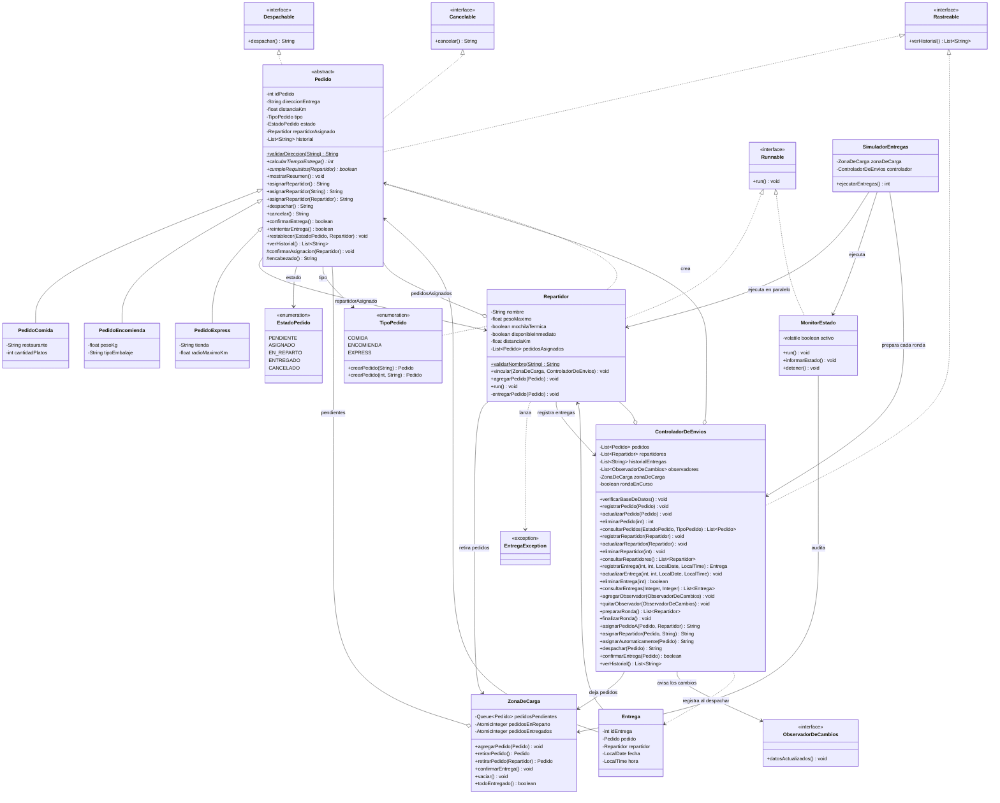
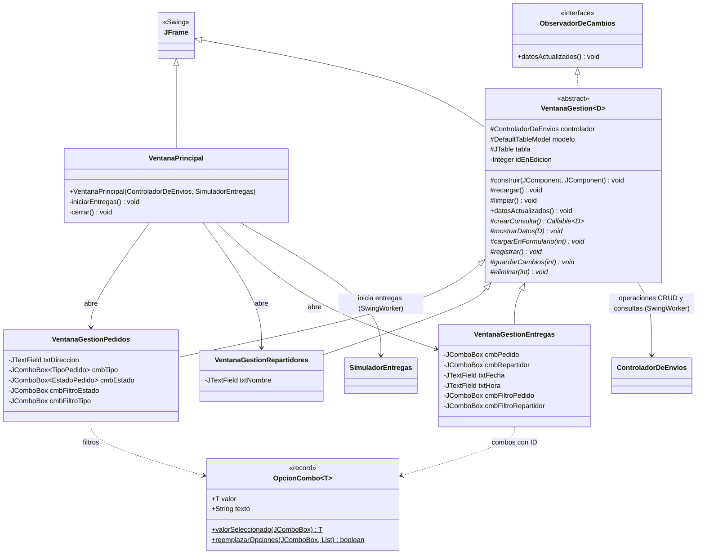
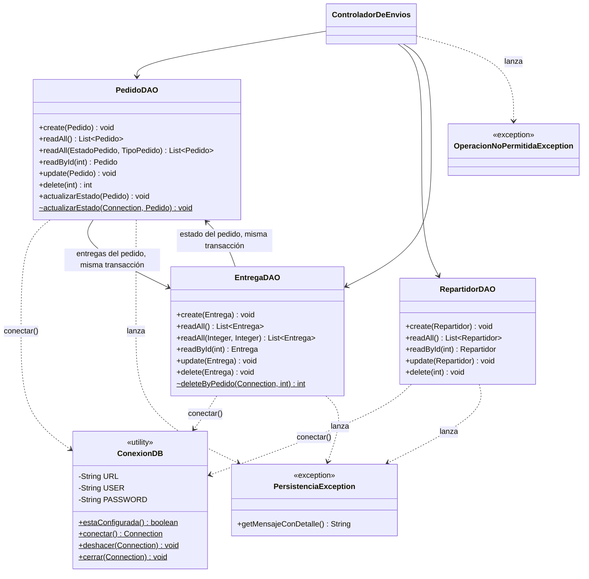
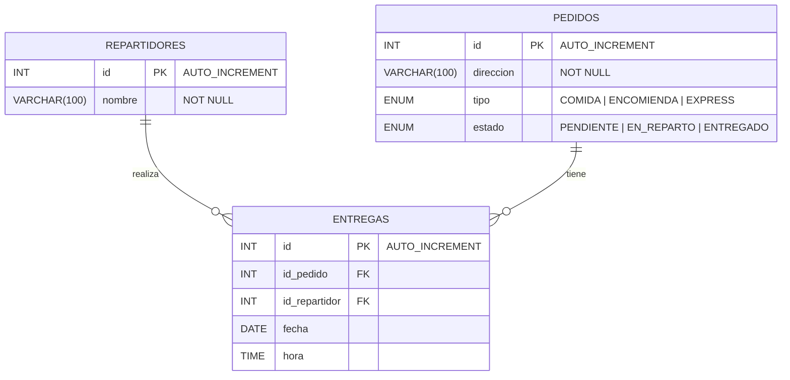

# SpeedFast — Sistema de Gestión de Entregas

## Descripción

SpeedFast es un prototipo de software desarrollado en Java para las actividades formativas y sumativas de la asignatura **Desarrollo Orientado a Objetos II**. Modela la operación de una empresa de reparto a domicilio que ofrece tres tipos de servicio: pedidos de comida de restaurantes, encomiendas (documentos o paquetes) y compras express en supermercado o farmacia.

El proyecto se construye de forma incremental:

* **Semana 1 — "Explorando la sobrecarga y sobreescritura en clases derivadas"**: jerarquía de pedidos y método `asignarRepartidor()` sobrecargado y sobrescrito según el tipo de servicio.
* **Semana 2 — "Definiendo una clase abstracta y su jerarquía"**: `Pedido` se convierte en **clase abstracta**, se incorpora el atributo común `distanciaKm`, el método implementado `mostrarResumen()` y el método abstracto `calcularTiempoEntrega()`.
* **Semana 3 — "Diseñando un sistema orientado a objetos con clases abstractas, polimorfismo e interfaces"**: se incorporan las interfaces `Despachable`, `Cancelable` y `Rastreable`, el estado del pedido, y la clase `ControladorDeEnvios`, que concentra la lógica de gestión sobre colecciones dinámicas (`ArrayList`).
* **Semana 4 — "Ejecutando tareas en paralelo con hilos en Java"**: `Repartidor` implementa `Runnable` y cada repartidor pasa a ejecutarse como un hilo independiente que recorre su propia lista de pedidos. `Main` lanza a todos los repartidores en paralelo con `ExecutorService`, y el acceso al historial compartido se protege con `synchronized`.
* **Semana 5 — "Sincronizando procesos en sistemas concurrentes"**: los pedidos dejan de repartirse de antemano y pasan a una `ZonaDeCarga` compartida, desde la cual los repartidores los retiran de a uno compitiendo entre sí. La sincronización garantiza que cada pedido sea retirado y entregado por un único repartidor, y un `MonitorEstado` audita el sistema en tiempo real.
* **Semana 6 — "Diseñando interfaces gráficas para aplicaciones en Java"**: el sistema incorpora una interfaz de escritorio construida con **Java Swing**. Desde una `VentanaPrincipal` se abre un formulario para registrar pedidos con validación de campos, un listado de pedidos en `JTable`, y se inician las entregas concurrentes sin bloquear el hilo gráfico.
* **Semana 7 — "Conectando aplicaciones Java con bases de datos mediante JDBC"**: pedidos, repartidores y entregas pasan a guardarse en una base de datos **MySQL** mediante **JDBC**. Una capa `dao` (`ConexionBD`, `PedidoDAO`, `RepartidorDAO` y `EntregaDAO`) concentra el acceso a datos: los formularios registran pedidos y repartidores directamente en la base de datos, y el listado `JTable` consulta los pedidos almacenados y se actualiza solo mientras avanzan las entregas.
* **Semana 8 — "Gestión de pedidos en SpeedFast" (operaciones CRUD)**: cada DAO ofrece las operaciones `create()`, `readAll()`, `update()` y `delete()`, y la interfaz incorpora una ventana de gestión por entidad —pedidos, repartidores y entregas— con formulario, filtros y `JTable`. Las entregas se registran eligiendo el pedido y el repartidor desde `JComboBox` cargados desde la base de datos, las entradas se validan antes de cada operación y las operaciones relacionadas se guardan en una misma transacción.

> El proyecto se mantiene como un único proyecto Maven en la raíz del repositorio: cada semana se construye sobre la anterior, y el avance semanal queda registrado en los commits en lugar de duplicar el código en carpetas separadas.

Cada tipo de pedido tiene criterios distintos, tanto para asignar repartidor como para estimar su tiempo de entrega:

* **Comida** — requiere un repartidor con mochila térmica.
* **Encomienda** — requiere validar el peso del bulto y su embalaje.
* **Compra express** — debe asignarse al repartidor más cercano con disponibilidad inmediata.

El sistema aplica los principios fundamentales de la Programación Orientada a Objetos:

* **Abstracción** — `Pedido` es una clase abstracta: reúne lo común a todo pedido y no puede instanciarse por sí sola, ya que un "pedido genérico" no existe en el dominio.
* **Encapsulamiento** — todos los atributos son `private` y se acceden mediante getters y setters públicos. El estado del pedido solo cambia a través de sus propias operaciones.
* **Herencia** — jerarquía `Pedido → PedidoComida / PedidoEncomienda / PedidoExpress`, donde la clase base concentra los atributos y el comportamiento común. Cada ventana de la interfaz hereda de `JFrame`.
* **Métodos abstractos** — `calcularTiempoEntrega()` y `cumpleRequisitos()` se declaran sin cuerpo en la clase base y obligan a cada subclase a definir su propia regla.
* **Sobrescritura (*overriding*)** — cada subclase redefine `asignarRepartidor()`, `calcularTiempoEntrega()` y `cumpleRequisitos()` con `@Override`.
* **Sobrecarga (*overloading*)** — el método `asignarRepartidor()` existe en tres firmas distintas: sin parámetros, con el nombre del repartidor (`String`) y con el objeto `Repartidor` completo.
* **Interfaces** — `Despachable`, `Cancelable` y `Rastreable` desacoplan las operaciones de despacho, cancelación y seguimiento de la jerarquía de pedidos.
* **Polimorfismo** — el `ControladorDeEnvios` trabaja con referencias `Pedido` y con listas `List<Pedido>`, sin conocer el tipo concreto de cada objeto. El formulario y `PedidoDAO` crean un `PedidoComida`, `PedidoEncomienda` o `PedidoExpress` según el `TipoPedido`, y el controlador lo registra simplemente como `Pedido`. Las tres ventanas de gestión heredan de la clase abstracta `VentanaGestion` y cada una define sus propias operaciones.
* **Colecciones dinámicas** — el controlador administra `ArrayList` de pedidos, repartidores e historial de entregas.
* **Separación de responsabilidades (MVC + DAO)** — el modelo no conoce la interfaz ni JDBC; las ventanas solo disparan operaciones del `ControladorDeEnvios` y muestran sus datos; el controlador aplica las reglas del negocio y delega la persistencia en los DAO; `Main` solo arma el sistema y abre la ventana principal.
* **Validación en el modelo** — `Pedido` y `Repartidor` validan su dirección y su nombre al crearse, y `Entrega` exige pedido, repartidor, fecha y hora: ningún objeto inválido llega a la base de datos, sin importar desde dónde se cree. Los formularios reutilizan esas mismas reglas.
* **Persistencia (JDBC)** — `ConexionDB` abre las conexiones con `DriverManager`; los DAO ejecutan sentencias `PreparedStatement` y leen los resultados con `ResultSet`. Toda conexión se cierra al terminar, con *try-with-resources* o en un bloque `finally`.
* **Patrón DAO** — cada tabla tiene su propia clase de acceso a datos con las operaciones CRUD, de modo que el SQL no se mezcla con la lógica de negocio ni con la interfaz.
* **Patrón Observer** — las ventanas de gestión se registran como `ObservadorDeCambios` del controlador, que les avisa cada vez que se registra, modifica o elimina un dato. Así las tablas y los combos de todas las ventanas abiertas se actualizan después de cada operación.
* **Concurrencia** — `Repartidor` implementa `Runnable` y se ejecuta en paralelo mediante `ExecutorService`, con pausas aleatorias que simulan cada entrega.
* **Recurso compartido** — la `ZonaDeCarga` es accedida simultáneamente por los tres hilos de repartidor; sus métodos `synchronized` garantizan que cada pedido sea retirado por un único repartidor.
* **Sincronización** — `synchronized` protege las secciones críticas, `AtomicInteger` lleva los contadores sin bloqueo y `volatile` comunica la orden de detención al monitor.
* **Manejo de excepciones** — `EntregaException` e `InterruptedException` se capturan por pedido, de modo que un fallo no detiene el recorrido completo. Los DAO envuelven cada `SQLException` en una `PersistenciaException` con un mensaje comprensible, y el controlador lanza una `OperacionNoPermitidaException` cuando una operación contradice una regla del negocio. En la interfaz, los datos inválidos, las operaciones no permitidas y los errores de base de datos se informan con `JOptionPane` sin cerrar el formulario.

---

## Estructura del proyecto

```text
speedfast/
├── sql/
│   ├── 01_crear_base_datos.sql         # Base speedfast_db, tablas del esquema y verificación de claves foráneas
│   └── 02_datos_ejemplo.sql            # Repartidores, pedidos y entregas de ejemplo (opcional)
├── src/main/java/com/speedfast/
│   ├── main/
│   │   └── Main.java                   # Arma el sistema, comprueba la base de datos y abre la ventana principal
│   ├── model/
│   │   ├── Pedido.java                 # Clase abstracta; implementa las 3 interfaces
│   │   ├── PedidoComida.java           # Mochila térmica · 15 min + 2 min/km
│   │   ├── PedidoEncomienda.java       # Peso y embalaje · 20 min + 1,5 min/km
│   │   ├── PedidoExpress.java          # Cercanía y disponibilidad · 10 min (+5 si > 5 km)
│   │   ├── TipoPedido.java             # Enum: comida, encomienda, express; crea cada subclase
│   │   ├── Repartidor.java             # Implementa Runnable: retira y entrega pedidos en un hilo
│   │   ├── Entrega.java                # Relación pedido–repartidor con fecha y hora
│   │   ├── EstadoPedido.java           # Enum: pendiente, asignado, en reparto, entregado, cancelado
│   │   ├── Despachable.java            # Interfaz: despachar()
│   │   ├── Cancelable.java             # Interfaz: cancelar()
│   │   └── Rastreable.java             # Interfaz: verHistorial()
│   ├── dao/
│   │   ├── ConexionDB.java             # Conexión JDBC con DriverManager; contraseña obligatoria
│   │   ├── PedidoDAO.java              # CRUD de pedidos, con filtros por estado y tipo
│   │   ├── RepartidorDAO.java          # CRUD de repartidores
│   │   └── EntregaDAO.java             # CRUD de entregas, con filtros por pedido y repartidor
│   ├── exception/
│   │   ├── EntregaException.java                # Error de dominio al entregar un pedido
│   │   ├── OperacionNoPermitidaException.java   # Operación que contradice una regla del negocio
│   │   └── PersistenciaException.java           # Error al operar con la base de datos
│   ├── service/
│   │   ├── ControladorDeEnvios.java    # Controlador compartido: reglas del negocio y uso de los DAO
│   │   ├── ObservadorDeCambios.java    # Interfaz Observer: avisa a las ventanas que los datos cambiaron
│   │   ├── ZonaDeCarga.java            # Recurso compartido: retiro sincronizado de pedidos
│   │   ├── SimuladorEntregas.java      # Ciclo de vida de los hilos de cada ronda de entregas
│   │   └── MonitorEstado.java          # Hilo que audita el sistema en tiempo real
│   └── view/
│       ├── VentanaPrincipal.java            # Botones de navegación e inicio de entregas
│       ├── VentanaGestion.java              # Base abstracta de las ventanas de gestión (CRUD)
│       ├── VentanaGestionPedidos.java       # CRUD de pedidos con filtros por estado y tipo
│       ├── VentanaGestionRepartidores.java  # CRUD de repartidores
│       ├── VentanaGestionEntregas.java      # CRUD de entregas con combos de pedido y repartidor
│       └── OpcionCombo.java                 # Opción de JComboBox: texto legible que conserva el ID
├── src/main/resources/images/          # Evidencias de ejecución
├── pom.xml                             # Incluye la dependencia mysql-connector-j
└── README.md
```

---

## Diagrama de clases

### Dominio y servicios


```mermaid
classDiagram
    class Despachable {
        <<interface>>
        +despachar() String
    }
    class Cancelable {
        <<interface>>
        +cancelar() String
    }
    class Rastreable {
        <<interface>>
        +verHistorial() List~String~
    }

    class Pedido {
        <<abstract>>
        -int idPedido
        -String direccionEntrega
        -float distanciaKm
        -TipoPedido tipo
        -EstadoPedido estado
        -Repartidor repartidorAsignado
        -List~String~ historial
        +validarDireccion(String)$ String
        +calcularTiempoEntrega()* int
        +cumpleRequisitos(Repartidor)* boolean
        +mostrarResumen() void
        +asignarRepartidor() String
        +asignarRepartidor(String) String
        +asignarRepartidor(Repartidor) String
        +despachar() String
        +cancelar() String
        +confirmarEntrega() boolean
        +reintentarEntrega() boolean
        +restablecer(EstadoPedido, Repartidor) void
        +verHistorial() List~String~
        #confirmarAsignacion(Repartidor) void
        #encabezado() String
    }

    class TipoPedido {
        <<enumeration>>
        COMIDA
        ENCOMIENDA
        EXPRESS
        +crearPedido(String) Pedido
        +crearPedido(int, String) Pedido
    }

    class Entrega {
        -int idEntrega
        -Pedido pedido
        -Repartidor repartidor
        -LocalDate fecha
        -LocalTime hora
    }

    class PedidoComida {
        -String restaurante
        -int cantidadPlatos
    }
    class PedidoEncomienda {
        -float pesoKg
        -String tipoEmbalaje
    }
    class PedidoExpress {
        -String tienda
        -float radioMaximoKm
    }

    class ControladorDeEnvios {
        -List~Pedido~ pedidos
        -List~Repartidor~ repartidores
        -List~String~ historialEntregas
        -List~ObservadorDeCambios~ observadores
        -ZonaDeCarga zonaDeCarga
        -boolean rondaEnCurso
        +verificarBaseDeDatos() void
        +registrarPedido(Pedido) void
        +actualizarPedido(Pedido) void
        +eliminarPedido(int) int
        +consultarPedidos(EstadoPedido, TipoPedido) List~Pedido~
        +registrarRepartidor(Repartidor) void
        +actualizarRepartidor(Repartidor) void
        +eliminarRepartidor(int) void
        +consultarRepartidores() List~Repartidor~
        +registrarEntrega(int, int, LocalDate, LocalTime) Entrega
        +actualizarEntrega(int, int, LocalDate, LocalTime) void
        +eliminarEntrega(int) boolean
        +consultarEntregas(Integer, Integer) List~Entrega~
        +agregarObservador(ObservadorDeCambios) void
        +quitarObservador(ObservadorDeCambios) void
        +prepararRonda() List~Repartidor~
        +finalizarRonda() void
        +asignarPedidoA(Pedido, Repartidor) String
        +asignarRepartidor(Pedido, String) String
        +asignarAutomaticamente(Pedido) String
        +despachar(Pedido) String
        +confirmarEntrega(Pedido) boolean
        +verHistorial() List~String~
    }

    class ObservadorDeCambios {
        <<interface>>
        +datosActualizados() void
    }

    class Runnable {
        <<interface>>
        +run() void
    }

    class ZonaDeCarga {
        -Queue~Pedido~ pedidosPendientes
        -AtomicInteger pedidosEnReparto
        -AtomicInteger pedidosEntregados
        +agregarPedido(Pedido) void
        +retirarPedido() Pedido
        +retirarPedido(Repartidor) Pedido
        +confirmarEntrega() void
        +vaciar() void
        +todoEntregado() boolean
    }

    class SimuladorEntregas {
        -ZonaDeCarga zonaDeCarga
        -ControladorDeEnvios controlador
        +ejecutarEntregas() int
    }

    class MonitorEstado {
        -volatile boolean activo
        +run() void
        +informarEstado() void
        +detener() void
    }

    class Repartidor {
        -String nombre
        -float pesoMaximo
        -boolean mochilaTermica
        -boolean disponibleInmediato
        -float distanciaKm
        -List~Pedido~ pedidosAsignados
        +validarNombre(String)$ String
        +vincular(ZonaDeCarga, ControladorDeEnvios) void
        +agregarPedido(Pedido) void
        +run() void
        -entregarPedido(Pedido) void
    }

    class EstadoPedido {
        <<enumeration>>
        PENDIENTE
        ASIGNADO
        EN_REPARTO
        ENTREGADO
        CANCELADO
    }

    class EntregaException {
        <<exception>>
    }

    Despachable <|.. Pedido
    Cancelable <|.. Pedido
    Rastreable <|.. Pedido
    Rastreable <|.. ControladorDeEnvios
    Runnable <|.. Repartidor
    Runnable <|.. MonitorEstado
    Repartidor --> ZonaDeCarga : retira pedidos
    MonitorEstado --> ZonaDeCarga : audita
    ZonaDeCarga o-- Pedido : pendientes
    ControladorDeEnvios --> ZonaDeCarga : deja pedidos
    SimuladorEntregas --> Repartidor : ejecuta en paralelo
    SimuladorEntregas --> MonitorEstado : ejecuta
    SimuladorEntregas --> ControladorDeEnvios : prepara cada ronda
    ControladorDeEnvios --> ObservadorDeCambios : avisa los cambios
    Pedido <|-- PedidoComida
    Pedido <|-- PedidoEncomienda
    Pedido <|-- PedidoExpress
    Pedido --> Repartidor : repartidorAsignado
    Pedido --> EstadoPedido : estado
    Pedido --> TipoPedido : tipo
    TipoPedido ..> Pedido : crea
    Entrega --> Pedido
    Entrega --> Repartidor
    ControladorDeEnvios ..> Entrega : registra al despachar
    Repartidor o-- Pedido : pedidosAsignados
    Repartidor ..> EntregaException : lanza
    Repartidor --> ControladorDeEnvios : registra entregas
    ControladorDeEnvios o-- Pedido
    ControladorDeEnvios o-- Repartidor
```

### Interfaz gráfica


```mermaid
classDiagram
    class JFrame {
        <<Swing>>
    }
    class ObservadorDeCambios {
        <<interface>>
        +datosActualizados() void
    }
    class VentanaPrincipal {
        +VentanaPrincipal(ControladorDeEnvios, SimuladorEntregas)
        -iniciarEntregas() void
        -cerrar() void
    }
    class VentanaGestion~D~ {
        <<abstract>>
        #ControladorDeEnvios controlador
        #DefaultTableModel modelo
        #JTable tabla
        -Integer idEnEdicion
        #construir(JComponent, JComponent) void
        #recargar() void
        #limpiar() void
        +datosActualizados() void
        #crearConsulta()* Callable~D~
        #mostrarDatos(D)* void
        #cargarEnFormulario(int)* void
        #registrar()* void
        #guardarCambios(int)* void
        #eliminar(int)* void
    }
    class VentanaGestionPedidos {
        -JTextField txtDireccion
        -JComboBox~TipoPedido~ cmbTipo
        -JComboBox~EstadoPedido~ cmbEstado
        -JComboBox cmbFiltroEstado
        -JComboBox cmbFiltroTipo
    }
    class VentanaGestionRepartidores {
        -JTextField txtNombre
    }
    class VentanaGestionEntregas {
        -JComboBox cmbPedido
        -JComboBox cmbRepartidor
        -JTextField txtFecha
        -JTextField txtHora
        -JComboBox cmbFiltroPedido
        -JComboBox cmbFiltroRepartidor
    }
    class OpcionCombo~T~ {
        <<record>>
        +T valor
        +String texto
        +valorSeleccionado(JComboBox)$ T
        +reemplazarOpciones(JComboBox, List)$ boolean
    }

    JFrame <|-- VentanaPrincipal
    JFrame <|-- VentanaGestion
    ObservadorDeCambios <|.. VentanaGestion
    VentanaGestion <|-- VentanaGestionPedidos
    VentanaGestion <|-- VentanaGestionRepartidores
    VentanaGestion <|-- VentanaGestionEntregas
    VentanaPrincipal --> VentanaGestionPedidos : abre
    VentanaPrincipal --> VentanaGestionRepartidores : abre
    VentanaPrincipal --> VentanaGestionEntregas : abre
    VentanaPrincipal --> SimuladorEntregas : inicia entregas (SwingWorker)
    VentanaGestion --> ControladorDeEnvios : operaciones CRUD y consultas (SwingWorker)
    VentanaGestionPedidos ..> OpcionCombo : filtros
    VentanaGestionEntregas ..> OpcionCombo : combos con ID
```

### Persistencia (DAO)


```mermaid
classDiagram
    class ConexionDB {
        <<utility>>
        -String URL
        -String USER
        -String PASSWORD
        +estaConfigurada()$ boolean
        +conectar()$ Connection
        +deshacer(Connection)$ void
        +cerrar(Connection)$ void
    }
    class PedidoDAO {
        +create(Pedido) void
        +readAll() List~Pedido~
        +readAll(EstadoPedido, TipoPedido) List~Pedido~
        +readById(int) Pedido
        +update(Pedido) void
        +delete(int) int
        +actualizarEstado(Pedido) void
        ~actualizarEstado(Connection, Pedido)$ void
    }
    class RepartidorDAO {
        +create(Repartidor) void
        +readAll() List~Repartidor~
        +readById(int) Repartidor
        +update(Repartidor) void
        +delete(int) void
    }
    class EntregaDAO {
        +create(Entrega) void
        +readAll() List~Entrega~
        +readAll(Integer, Integer) List~Entrega~
        +readById(int) Entrega
        +update(Entrega) void
        +delete(Entrega) void
        ~deleteByPedido(Connection, int)$ int
    }
    class PersistenciaException {
        <<exception>>
        +getMensajeConDetalle() String
    }
    class OperacionNoPermitidaException {
        <<exception>>
    }

    ControladorDeEnvios --> PedidoDAO
    ControladorDeEnvios --> RepartidorDAO
    ControladorDeEnvios --> EntregaDAO
    ControladorDeEnvios ..> OperacionNoPermitidaException : lanza
    PedidoDAO ..> ConexionDB : conectar()
    RepartidorDAO ..> ConexionDB : conectar()
    EntregaDAO ..> ConexionDB : conectar()
    EntregaDAO --> PedidoDAO : estado del pedido, misma transacción
    PedidoDAO --> EntregaDAO : entregas del pedido, misma transacción
    PedidoDAO ..> PersistenciaException : lanza
    RepartidorDAO ..> PersistenciaException : lanza
    EntregaDAO ..> PersistenciaException : lanza
```

---

## Clases principales

* **`Pedido`** *(abstracta)* — atributos comunes: `idPedido`, `direccionEntrega`, `distanciaKm`, `tipo`, `estado`, `repartidorAsignado` e `historial`. Implementa las tres interfaces y ofrece `mostrarResumen()`, `confirmarAsignacion()` y `encabezado()` como comportamiento reutilizable. `validarDireccion()` exige una dirección no vacía de hasta 100 caracteres, y la aplican el constructor y el *setter*. `reintentarEntrega()` devuelve a pendiente un pedido en reparto cuya entrega quedó sin efecto, y `restablecer()` permite a `PedidoDAO` reconstruir el estado guardado en la base de datos.
* **`TipoPedido`** — enumeración con los tres tipos de servicio. El nombre de cada constante (`COMIDA`, `ENCOMIENDA`, `EXPRESS`) es el valor de la columna `tipo` y el texto que muestra la interfaz, y su método `crearPedido()` crea la subclase correspondiente con valores estándar para los datos que la tabla no guarda (distancia, peso, tienda, etc.).
* **`PedidoComida`** — agrega `restaurante` y `cantidadPlatos`. Solo acepta repartidores con **mochila térmica**.
* **`PedidoEncomienda`** — agrega `pesoKg` y `tipoEmbalaje`. Valida la **capacidad de carga** del repartidor y que el **embalaje** esté declarado.
* **`PedidoExpress`** — agrega `tienda` y `radioMaximoKm`. Exige **disponibilidad inmediata** y **cercanía** dentro del radio de cobertura.
* **`Repartidor`** — datos del repartidor (`pesoMaximo`, `mochilaTermica`, `disponibleInmediato`, `distanciaKm`), que son los atributos que permiten validar cada tipo de pedido. Implementa `Runnable`: su método `run()` retira pedidos de la `ZonaDeCarga` mientras queden compatibles con su perfil, y los entrega simulando el traslado con pausas aleatorias. El constructor `Repartidor(id, nombre)` crea un repartidor a partir de lo que guarda la tabla, con un perfil estándar, y valida el nombre con `validarNombre()` (obligatorio, hasta 100 caracteres); `vincular()` le asigna la zona de carga y el controlador al incorporarlo a una ronda.
* **`Entrega`** — relaciona un pedido con el repartidor que lo lleva, junto a la fecha y hora en que salió a reparto. Corresponde a la tabla `entregas`. Su constructor exige pedido, repartidor, fecha y hora.
* **`ZonaDeCarga`** — recurso compartido donde llegan los pedidos. Sus métodos `agregarPedido()` y `retirarPedido()` son `synchronized`, lo que impide que dos repartidores retiren el mismo pedido. Lleva contadores `AtomicInteger` de pedidos en reparto y entregados.
* **`MonitorEstado`** — hilo que informa periódicamente cuántos pedidos hay pendientes, en reparto y entregados. Consulta solo los contadores atómicos, por lo que audita el sistema sin interferir con el trabajo de los repartidores.
* **`SimuladorEntregas`** — ejecuta una ronda de entregas: lanza a los repartidores con `ExecutorService` y al monitor en su propio hilo, espera el término de todos y cierra el monitor con `join()`.
* **`EstadoPedido`** — enumeración con los estados válidos de un pedido, evitando textos sueltos repartidos por el código. `registrables()` entrega los tres estados que admite la columna `estado` (`PENDIENTE`, `EN_REPARTO`, `ENTREGADO`); `ASIGNADO` y `CANCELADO` existen solo en memoria.
* **`EntregaException`** — excepción de dominio que permite informar por qué falló una entrega sin interrumpir el recorrido completo del repartidor.
* **`PersistenciaException`** — excepción que lanzan los DAO cuando una operación con la base de datos falla. Envuelve la `SQLException` original, de modo que el controlador y las ventanas informan el problema sin depender de JDBC.
* **`OperacionNoPermitidaException`** — excepción que lanza el controlador cuando una operación contradice una regla del negocio, por ejemplo registrar la entrega de un pedido que no está pendiente. La interfaz la informa como advertencia, no como error.
* **`ControladorDeEnvios`** — ofrece las operaciones CRUD de pedidos, repartidores y entregas, aplica las reglas del negocio antes de delegar en los DAO, prepara cada ronda de entregas y mantiene el historial. Es el controlador que comparten todas las ventanas, y les avisa de cada cambio por medio de `ObservadorDeCambios`. Protege sus listas y la marca de ronda en curso con `synchronized`, porque varios hilos de repartidor lo utilizan al mismo tiempo.
* **DAO (`dao`)** — `ConexionDB`, `PedidoDAO`, `RepartidorDAO` y `EntregaDAO`, descritos en las secciones [Operaciones CRUD](#operaciones-crud-semana-8) y [Persistencia con JDBC](#persistencia-con-jdbc-semana-7).
* **Ventanas (`view`)** — `VentanaPrincipal`, la base abstracta `VentanaGestion` y sus tres subclases, descritas en las secciones [Operaciones CRUD](#operaciones-crud-semana-8) e [Interfaz gráfica](#interfaz-gráfica-semanas-6-a-8).

### Interfaces implementadas

| Interfaz | Método | Implementada por | Propósito |
|---|---|---|---|
| `Despachable` | `despachar()` | `PedidoComida`, `PedidoEncomienda`, `PedidoExpress` (heredado de `Pedido`) | Enviar el pedido a reparto validando su estado |
| `Cancelable` | `cancelar()` | `PedidoComida`, `PedidoEncomienda`, `PedidoExpress` (heredado de `Pedido`) | Anular un pedido que aún no ha sido despachado |
| `Rastreable` | `verHistorial()` | `Pedido` y `ControladorDeEnvios` | Consultar el avance: eventos del pedido e historial global del sistema |

### Método abstracto `calcularTiempoEntrega()`

| Subclase | Fórmula | Ejemplo |
|---|---|---|
| `PedidoComida` | 15 min base + 2 min por kilómetro | 4 km → **23 minutos** |
| `PedidoEncomienda` | 20 min base + 1,5 min por kilómetro (redondeado a entero) | 6 km → **29 minutos** |
| `PedidoExpress` | 10 min base, +5 min si la distancia supera los 5 km | 7 km → **15 minutos** |

### Método abstracto `cumpleRequisitos(Repartidor)`

Permite que el `ControladorDeEnvios` busque un repartidor adecuado **sin conocer las reglas de cada tipo de pedido**: se las pregunta al propio pedido.

| Subclase | Requisito |
|---|---|
| `PedidoComida` | El repartidor cuenta con mochila térmica |
| `PedidoEncomienda` | La carga no supera la capacidad del repartidor y hay embalaje declarado |
| `PedidoExpress` | El repartidor tiene disponibilidad inmediata y está dentro del radio de cobertura |

### Sobrecarga del método `asignarRepartidor()`

| Firma | Comportamiento |
|---|---|
| `asignarRepartidor()` | Mensaje genérico: aún no se designa a nadie |
| `asignarRepartidor(String nombreRepartidor)` | Registra el candidato en el historial del pedido y advierte que la asignación aún no se confirma: sin el objeto no es posible validar los requisitos |
| `asignarRepartidor(Repartidor repartidor)` | Valida los requisitos del tipo de pedido y, si se cumplen, registra la asignación |

Para asignar por nombre de forma efectiva se usa `ControladorDeEnvios.asignarRepartidor(pedido, nombre)`: el controlador es quien conoce la lista de repartidores, resuelve el nombre y delega en la versión que sí valida. Así el mensaje mostrado en consola nunca afirma algo que el estado del objeto no refleje.

---

## Operaciones CRUD (Semana 8)

En esta semana se completa el ciclo de los datos: las tres entidades del sistema —repartidores, pedidos y entregas— pueden registrarse, consultarse, editarse y eliminarse desde la interfaz gráfica, y cada operación se guarda en MySQL mediante JDBC.

### Paso 1: base de datos

El esquema de esta semana cambia respecto del de la Semana 7, por lo que `sql/01_crear_base_datos.sql` se reescribió para reproducir exactamente el script de las instrucciones:

| Cambio | Semana 7 | Semana 8 |
|---|---|---|
| Nombres de las tablas | `repartidor`, `pedido`, `entrega` | `repartidores`, `pedidos`, `entregas` |
| Columnas `tipo` y `estado` | `VARCHAR` | `ENUM` con los valores válidos |
| Largo de `direccion` | 150 caracteres | 100 caracteres |

> Si existe la base `speedfast_db` de la Semana 7, hay que eliminarla antes de ejecutar el script (`DROP DATABASE speedfast_db;`), ya que las tablas cambiaron de nombre.


```mermaid
erDiagram
    REPARTIDORES ||--o{ ENTREGAS : realiza
    PEDIDOS ||--o{ ENTREGAS : tiene
    REPARTIDORES {
        INT id PK "AUTO_INCREMENT"
        VARCHAR(100) nombre "NOT NULL"
    }
    PEDIDOS {
        INT id PK "AUTO_INCREMENT"
        VARCHAR(100) direccion "NOT NULL"
        ENUM tipo "COMIDA | ENCOMIENDA | EXPRESS"
        ENUM estado "PENDIENTE | EN_REPARTO | ENTREGADO"
    }
    ENTREGAS {
        INT id PK "AUTO_INCREMENT"
        INT id_pedido FK
        INT id_repartidor FK
        DATE fecha
        TIME hora
    }
```

* Un **repartidor** puede realizar **muchas entregas**.
* Un **pedido** puede tener **una o varias entregas**: cada entrega es un intento. Si un intento queda sin efecto, el pedido vuelve a pendiente y se registra un nuevo intento al despacharlo otra vez.
* Cada **entrega** se asocia a un **pedido** y a un **repartidor** mediante claves foráneas.

La carpeta `sql/` contiene dos scripts, que se ejecutan en MySQL Workbench (*File → Open SQL Script* y luego *Execute*) o por consola:

```bash
mysql -u root -p < sql/01_crear_base_datos.sql
mysql -u root -p < sql/02_datos_ejemplo.sql
```

| Script | Contenido |
|---|---|
| `01_crear_base_datos.sql` | Crea la base `speedfast_db` y las tablas `repartidores`, `pedidos` y `entregas` del script de las instrucciones. Al final, una consulta a `information_schema.KEY_COLUMN_USAGE` verifica que las dos claves foráneas de `entregas` se hayan creado |
| `02_datos_ejemplo.sql` | *(Opcional)* Tres repartidores, seis pedidos pendientes y dos pedidos con su entrega registrada (uno entregado y otro en reparto), para que las tres ventanas de gestión no partan vacías |

El resultado esperado de la verificación es:

```text
+------------+---------------+-----------------+-----------------------+------------------------+
| TABLE_NAME | COLUMN_NAME   | CONSTRAINT_NAME | REFERENCED_TABLE_NAME | REFERENCED_COLUMN_NAME |
+------------+---------------+-----------------+-----------------------+------------------------+
| entregas   | id_pedido     | entregas_ibfk_1 | pedidos               | id                     |
| entregas   | id_repartidor | entregas_ibfk_2 | repartidores          | id                     |
+------------+---------------+-----------------+-----------------------+------------------------+
```

### Paso 2: DAO con CRUD completo

Cada DAO ofrece los cuatro métodos que indican las instrucciones:

| DAO | `create()` | `readAll()` | `update()` | `delete()` |
|---|---|---|---|---|
| `RepartidorDAO` | `INSERT` del nombre | `SELECT` de todos los repartidores | `UPDATE` del nombre | `DELETE` del repartidor |
| `PedidoDAO` | `INSERT` de dirección, tipo y estado | `SELECT` con el repartidor de la última entrega; filtros opcionales por estado y tipo | `UPDATE` de dirección, tipo y estado | `DELETE` de sus entregas y del pedido, en una transacción |
| `EntregaDAO` | `INSERT` de la entrega y `UPDATE` del estado de su pedido, en una transacción | `SELECT` con su pedido y su repartidor (`JOIN`); filtros opcionales por pedido y repartidor | `UPDATE` de pedido, repartidor, fecha y hora | `DELETE` de la entrega y `UPDATE` del estado de su pedido, en una transacción |

Además, cada DAO tiene `readById(int)`, que el controlador usa para comprobar las reglas del negocio con los datos vigentes.

* Todas las sentencias usan `PreparedStatement`: los valores viajan como parámetros y no concatenados en el SQL, lo que evita la inyección SQL y los errores con caracteres especiales.
* Los filtros opcionales se resuelven con una única consulta parametrizada, por ejemplo `WHERE (? IS NULL OR p.estado = ?) AND (? IS NULL OR p.tipo = ?)`. Cada filtro se envía dos veces: si su valor es `NULL` (opción **Todos**), la condición se cumple siempre.
* `create()` obtiene el ID generado con `getGeneratedKeys()` y lo asigna al objeto.
* `update()` y `delete()` comprueban que la sentencia haya afectado una fila. Si no afectó ninguna, el registro ya no existe (por ejemplo, porque se eliminó desde otra ventana), y se informa así.
* Los resultados se leen con `ResultSet` y se convierten en objetos del modelo. `EntregaDAO` reutiliza la lectura de pedidos de `PedidoDAO`, porque sus consultas devuelven las columnas del pedido con los mismos nombres.

> Las instrucciones mencionan una clase `ClienteDAO` para "gestionar clientes", pero ni el esquema ni los requerimientos funcionales incluyen clientes: las entidades del sistema son repartidores, pedidos y entregas. Por eso los DAO son `RepartidorDAO`, `PedidoDAO` y `EntregaDAO`, cada uno con los métodos CRUD indicados.

### Paso 3: ventanas de gestión

La ventana principal abre una ventana de gestión por entidad:

| Ventana | Formulario | Filtros | Tabla |
|---|---|---|---|
| `VentanaGestionPedidos` | `JTextField` para la dirección y `JComboBox` para el tipo y el estado | Estado y tipo | ID, tipo, dirección, estado y repartidor de la última entrega |
| `VentanaGestionRepartidores` | `JTextField` para el nombre | — | ID y nombre |
| `VentanaGestionEntregas` | `JComboBox` para el pedido y el repartidor, `JTextField` para la fecha y la hora | Pedido y repartidor | ID, pedido, estado del pedido, repartidor, fecha y hora |

Las tres funcionan igual, porque heredan de la clase abstracta `VentanaGestion`:

1. Para **registrar**, se completa el formulario y se presiona **Registrar**.
2. Para **editar** o **eliminar**, se selecciona una fila de la tabla: sus datos pasan al formulario, un texto indica qué registro se está editando y se habilitan **Guardar cambios** y **Eliminar**. Toda eliminación pide confirmación.
3. **Limpiar** vuelve al modo de registro.
4. Cada filtro tiene la opción **Todos**, y al cambiarlo la tabla se consulta de nuevo.
5. El resultado de cada operación se informa con `JOptionPane`, y las tablas se actualizan solas.

**Combos con ID.** En la ventana de entregas, el pedido y el repartidor se eligen desde combos cargados desde la base de datos. Cada opción es un `OpcionCombo` (un `record`) que muestra un texto legible pero conserva internamente el ID: la opción "3 - Ñuñoa (PENDIENTE)" conserva el ID 3, y "1 - Juan Pérez" el ID 1. El combo de pedidos muestra también el estado, para elegir con facilidad un pedido pendiente. Al registrar, la ventana envía al controlador solo los ID.

**Actualización de tablas y combos (patrón Observer).** `ControladorDeEnvios` mantiene la lista de ventanas abiertas, que implementan `ObservadorDeCambios`. Después de cada operación exitosa —desde cualquier ventana, o de los repartidores durante una ronda— les avisa, y cada una vuelve a consultar la base de datos con un `SwingWorker` y actualiza su tabla y sus combos:

* Al registrar una entrega, la tabla de pedidos muestra de inmediato el pedido en reparto, junto a su repartidor.
* Al registrar, editar o eliminar un pedido o un repartidor, los combos de la ventana de entregas lo reflejan al instante.
* Al recargar se conservan la fila en edición y la opción elegida en cada combo, de modo que el usuario no pierde lo que estaba haciendo.

Esto reemplaza al `Timer` de la Semana 7, que consultaba la base de datos cada segundo: ahora solo se consulta cuando algo cambió. El botón **Refrescar** se mantiene para ver cambios hechos fuera de la aplicación, por ejemplo en MySQL Workbench.

### Reglas del negocio y consistencia

Las reglas se aplican en `ControladorDeEnvios`, antes de llamar a los DAO. Cuando una operación afecta a dos tablas, ambos cambios se guardan en una misma transacción.

| Operación | Regla | Consistencia |
|---|---|---|
| Registrar entrega | Solo para pedidos `PENDIENTE`. El pedido queda asignado al repartidor y pasa a `EN_REPARTO`, igual que cuando lo retira un repartidor de la simulación (se reutilizan `asignarRepartidor()` y `despachar()` del modelo) | Inserción de la entrega y cambio de estado del pedido en una transacción |
| Editar entrega | Se corrigen el repartidor, la fecha y la hora. El pedido no cambia, porque la entrega es parte de su historial | El combo de pedido se deshabilita al editar |
| Eliminar entrega | Si era la entrega más reciente de un pedido `EN_REPARTO`, el pedido vuelve a `PENDIENTE`: ya no hay un repartidor que lo lleve | Eliminación y cambio de estado en una transacción |
| Eliminar pedido | Se eliminan también sus entregas, que son el historial de sus intentos. La confirmación lo advierte | Primero las entregas (por la clave foránea) y luego el pedido, en una transacción |
| Eliminar repartidor | No se permite si tiene entregas registradas: borrarlas dejaría pedidos entregados sin registro de quién los llevó | El controlador lo comprueba antes, y la clave foránea lo impediría igualmente |
| Editar o eliminar durante una ronda | No se permite, porque los repartidores están trabajando con esos datos. Registrar pedidos y repartidores sí se permite: participan desde la ronda siguiente | Métodos `synchronized`: una ronda no puede comenzar entre la comprobación y la operación |

Para marcar manualmente un pedido como entregado, se edita su estado en la gestión de pedidos.

### Paso 4: validaciones y manejo de errores

Antes de ejecutar cualquier operación, los formularios validan sus campos:

| Formulario | Campo | Regla |
|---|---|---|
| Pedido | Dirección | Obligatoria, de hasta 100 caracteres (`Pedido.validarDireccion()`) |
| Pedido | Tipo y estado | Se eligen de listas con los valores del `ENUM`, por lo que siempre son válidos |
| Repartidor | Nombre | Obligatorio, de hasta 100 caracteres (`Repartidor.validarNombre()`) |
| Entrega | Pedido y repartidor | Deben estar seleccionados. Si no hay opciones, se indica en qué ventana registrarlas |
| Entrega | Fecha | Obligatoria, con formato `dd-mm-aaaa` y existente: la validación estricta rechaza, por ejemplo, el 31-02-2026 |
| Entrega | Hora | Obligatoria, con formato `hh:mm` o `hh:mm:ss` de 24 horas |

Si un dato no es válido, se informa el motivo, el cursor vuelve al campo y no se ejecuta ninguna operación. Al registrar una entrega, la fecha y la hora parten con el momento actual.

Cada operación de las ventanas se ejecuta dentro de un bloque `try-catch` que distingue el tipo de problema:

| Situación | Mensaje (`JOptionPane`) |
|---|---|
| Dato inválido en el formulario | Advertencia **Dato inválido** con el motivo |
| Regla del negocio (`OperacionNoPermitidaException`) | Advertencia **Operación no permitida** con el motivo, por ejemplo: "El pedido #7 se encuentra ENTREGADO. Solo se pueden registrar entregas de pedidos pendientes." |
| Error de MySQL (`PersistenciaException`) | Error **Error de base de datos** con la operación que falló y el detalle que entrega MySQL |
| Registro eliminado desde otra ventana | Error indicando, por ejemplo, "No existe el pedido #5 en la base de datos." |
| Operación exitosa | Información **Operación exitosa**, por ejemplo "Pedido #9 registrado correctamente." |
| Sin conexión al recargar una tabla | Lo informa la barra de estado de la ventana, con el detalle de MySQL en su *tooltip*, sin abrir un diálogo por cada aviso |

### Rondas de entregas con datos editables

Como ahora los datos pueden cambiar desde la interfaz, la simulación concurrente de las semanas anteriores se ajustó:

* Cada ronda carga desde la base de datos a los repartidores y los pedidos pendientes (`ControladorDeEnvios.prepararRonda()`), en lugar de mantenerlos en memoria desde el inicio de la aplicación. Así siempre trabaja con lo guardado, incluidos los cambios hechos desde las ventanas de gestión.
* Mientras dura la ronda, el controlador rechaza las operaciones que podrían interferir con los repartidores (ver la tabla de reglas), y las ventanas muestran el avance gracias a los avisos del controlador.
* La ventana principal no se cierra mientras hay una ronda en curso, para que ningún pedido quede en reparto sin terminar de entregarse.

### Decisiones de diseño

* **Nombres de los métodos CRUD.** Los DAO usan los nombres que indican las instrucciones (`create`, `readAll`, `update`, `delete`), y `readById` sigue la misma convención. El resto del proyecto mantiene sus nombres en español. Por la misma razón, la clase de conexión se renombró de `ConexionBD` a `ConexionDB`.
* **Una ventana por entidad, con una base común.** `VentanaGestion` concentra la estructura, el modo de edición, la recarga en segundo plano y los mensajes, y cada subclase define solo sus campos, columnas y operaciones. `VentanaRegistroPedido` y `VentanaListaPedidos` se unieron en `VentanaGestionPedidos`, y `VentanaRegistroRepartidor` pasó a ser `VentanaGestionRepartidores`: cada entidad se registra, consulta, edita y elimina en un mismo lugar.
* **La interfaz muestra los valores del modelo.** Tipos y estados aparecen con los mismos nombres que en la base de datos (`COMIDA`, `EN_REPARTO`, etc.), de modo que lo que se ve en la aplicación coincide con lo que se consulta en MySQL Workbench.
* **Sin recuperación automática al iniciar.** En la Semana 7, un pedido `EN_REPARTO` al iniciar la aplicación solo podía deberse a una ronda interrumpida, y se devolvía a pendiente. Ahora un pedido también queda en reparto al registrar su entrega manualmente o al editar su estado, así que esa suposición ya no es válida. En su lugar, la aplicación no se cierra durante una ronda, y el estado de cualquier pedido puede corregirse desde la gestión de pedidos.
* **Pedidos cancelados.** La columna `estado` no admite `CANCELADO`, por lo que se quitó `ControladorDeEnvios.cancelar()`: un pedido que no se entregará se elimina desde la gestión de pedidos. `Pedido` mantiene la interfaz `Cancelable` del modelo.
* **Operaciones en el hilo gráfico.** Registrar, editar y eliminar se ejecutan en el hilo gráfico, porque son breves y su resultado se informa de inmediato con `JOptionPane`. Las consultas que recargan las tablas, que pueden llegar seguidas durante una ronda, se ejecutan con `SwingWorker`.

### Mejoras aplicadas a partir de la retroalimentación de la Semana 7

* **Validaciones también en el modelo.** La dirección vacía y el largo máximo ya no se controlan solo en el formulario: `Pedido` y `Repartidor` validan su dirección y su nombre en el constructor (y `Pedido` también en su *setter*), y `Entrega` exige pedido, repartidor, fecha y hora. Así ningún objeto inválido llega a los DAO, aunque se cree desde otra pantalla o proceso. Los formularios reutilizan esas mismas reglas (`Pedido.validarDireccion()` y `Repartidor.validarNombre()`), que quedan escritas en un solo lugar. Además, los DAO comprueban que cada `UPDATE` y `DELETE` haya encontrado su registro.
* **Contraseña obligatoria.** `ConexionDB` ya no tiene una contraseña de ejemplo: debe configurarse en la variable de entorno `SPEEDFAST_DB_PASSWORD`. Si no está definida, la aplicación lo informa al iniciar, explica cómo configurarla (IntelliJ IDEA, PowerShell o bash) y se cierra sin intentar conectarse.
* Tal como se proyectaba en el *feedforward*, la modificación y la eliminación se agregaron **sin perder la consistencia** de las operaciones relacionadas: eliminar un pedido junto a sus entregas, y registrar o eliminar una entrega junto al estado de su pedido, ocurren en una misma transacción, y un repartidor con entregas no se elimina. La organización por capas se mantuvo: las ventanas solo usan el controlador y ninguna contiene SQL.

---

## Persistencia con JDBC (Semana 7)

### Conexión JDBC

El driver se agrega al proyecto como dependencia de Maven en el `pom.xml` (`com.mysql:mysql-connector-j:9.7.0`, compatible con MySQL Server 8.0 y posteriores). Al abrir el proyecto, IntelliJ IDEA la descarga y la agrega al classpath, sin necesidad de configurar el *jar* a mano. Desde JDBC 4 el driver se registra solo, por lo que no hace falta `Class.forName()`.

`ConexionDB` gestiona la conexión con `DriverManager`, siguiendo el ejemplo de las instrucciones:

| Parámetro | Valor por defecto | Variable de entorno |
|---|---|---|
| `URL` | `jdbc:mysql://localhost:3306/speedfast_db` | `SPEEDFAST_DB_URL` (opcional) |
| `USER` | `root` | `SPEEDFAST_DB_USER` (opcional) |
| `PASSWORD` | *Sin valor por defecto* | `SPEEDFAST_DB_PASSWORD` (**obligatoria**) |

Desde la Semana 8, la contraseña no tiene un valor por defecto en el código: se lee solo desde la variable de entorno, así que ninguna contraseña, real o de ejemplo, queda en el repositorio. En IntelliJ IDEA se define en *Run → Edit Configurations… → Environment variables*. Si no está definida, la aplicación lo informa al iniciar y explica cómo configurarla.

### Flujo de los datos entre la interfaz y la base de datos

Las ventanas trabajan solo con `ControladorDeEnvios`, que aplica las reglas del negocio y delega en los DAO. Ninguna ventana contiene SQL ni conoce JDBC.

| Momento | Operación en la base de datos |
|---|---|
| Inicio de la aplicación | `readAll()` de los tres DAO, para comprobar que la base de datos esté disponible |
| **Registrar**, **Guardar cambios** o **Eliminar** en una ventana de gestión | `create()`, `update()` o `delete()` del DAO correspondiente; luego, todas las ventanas abiertas vuelven a consultar sus datos |
| Cambio de un filtro | `readAll()` con los filtros elegidos |
| Inicio de una ronda de entregas | `RepartidorDAO.readAll()` y `PedidoDAO.readAll()` de los pendientes, que pasan a la zona de carga |
| Un repartidor retira un pedido y sale a reparto | `EntregaDAO.create()`: nueva fila en `entregas` y pedido en `EN_REPARTO` |
| El repartidor confirma la entrega | `PedidoDAO.actualizarEstado()`: pedido en `ENTREGADO` |

Como todas las operaciones se guardan directamente en la base de datos, lo registrado desde la interfaz sigue disponible al volver a abrir la aplicación, y también puede consultarse en MySQL Workbench.

### Manejo de excepciones y cierre de recursos

| Situación | Tratamiento |
|---|---|
| Operación simple (un `INSERT`, `SELECT`, `UPDATE` o `DELETE`) | *try-with-resources*: `Connection`, `PreparedStatement` y `ResultSet` se cierran solos al salir del bloque, incluso si ocurre un error. Es la forma moderna del bloque `finally` que cierra los recursos |
| Operación de dos sentencias (registrar o eliminar una entrega, eliminar un pedido) | `try-catch-finally` explícito: `commit()` si ambas sentencias funcionan, `rollback()` en el `catch` si alguna falla, y `ConexionDB.cerrar()` en el `finally` en ambos casos |
| `SQLException` en un DAO | Se envuelve en una `PersistenciaException` que describe la operación ("No fue posible registrar el pedido…") y conserva la causa original |
| Contraseña no configurada al iniciar | Se informa con `JOptionPane` cómo definir `SPEEDFAST_DB_PASSWORD`, y la aplicación se cierra sin intentar conectarse |
| Error de conexión al iniciar | Se informa con `JOptionPane` indicando la URL y qué revisar (servidor en ejecución, base creada, contraseña), y la aplicación se cierra |
| Error de base de datos durante una entrega | El repartidor informa el error por consola y continúa con el siguiente pedido |
| Fila sin tipo o estado (las columnas `ENUM` admiten `NULL`) | `PedidoDAO` lanza una `PersistenciaException` que indica qué pedido tiene el dato faltante |

Los errores de las operaciones que se hacen desde las ventanas de gestión se describen en la sección [Operaciones CRUD](#paso-4-validaciones-y-manejo-de-errores).

### Decisiones de diseño

* **El esquema es exactamente el de las instrucciones.** No se agregaron columnas, de modo que el proyecto funciona sobre cualquier base creada con el script de las instrucciones. Como la tabla `repartidores` solo guarda el nombre y `pedidos` no guarda los datos propios de cada subclase, esos datos toman valores estándar: `TipoPedido` define los del pedido (3 km, 5 kg, embalaje "Caja", radio de 3 km) y `Repartidor(id, nombre)` define un perfil estándar (motocicleta con mochila térmica, 15 kg, disponible, a 1,5 km). Los valores se eligieron para que cualquier repartidor pueda atender cualquier pedido. Las reglas de `cumpleRequisitos()` se siguen evaluando igual que antes.
* **El ID lo asigna la base de datos.** Las tres tablas usan `AUTO_INCREMENT`, así que el formulario ya no pide el ID. Cada DAO lo obtiene con `getGeneratedKeys()` y lo asigna al objeto recién guardado. Esto además elimina la posibilidad de IDs repetidos.
* **La entrega se registra al salir a reparto.** En ese momento se conoce la relación entre pedido y repartidor, así que el listado puede mostrar quién lleva cada pedido mientras va en camino. La inserción de la entrega y el cambio de estado del pedido ocurren en una misma transacción: la base de datos nunca muestra una entrega cuyo pedido no figura en reparto, ni al revés.
* **Varias entregas por pedido.** Si un pedido en reparto vuelve a pendiente (por ejemplo, porque se eliminó su entrega o se editó su estado), el intento anterior puede quedar registrado en `entregas`, y al despacharlo otra vez se registra un nuevo intento. Es el caso de "varias entregas por pedido" que contempla el modelo, y el listado de pedidos muestra siempre al repartidor de la última. *(En la Semana 7, los pedidos que quedaban en reparto al cerrar la aplicación se devolvían a pendiente al iniciar; en la Semana 8 se reemplazó por otro mecanismo, explicado en sus [decisiones de diseño](#decisiones-de-diseño).)*
* **Una conexión por operación.** Una `Connection` no es segura para compartirse entre hilos, y los repartidores registran sus entregas en paralelo. Cada operación abre su propia conexión y la cierra al terminar, por lo que los hilos nunca comparten recursos de JDBC.
* **Los repartidores usan la base de datos fuera de los bloqueos.** En `ControladorDeEnvios`, los métodos que usan los repartidores protegen con `synchronized` solo las listas en memoria, y escriben en la base de datos fuera de esos bloqueos, de modo que ningún repartidor espera a que otro termine de escribir. Las operaciones de edición de las ventanas sí se ejecutan dentro de un bloqueo, pero solo proceden cuando no hay una ronda en curso, es decir, cuando ningún repartidor está trabajando.
* **Los estados `ASIGNADO` y `CANCELADO` existen solo en memoria.** La columna `estado` es un `ENUM` que solo admite los tres estados del modelo. `ASIGNADO` dura un instante, entre que el repartidor retira el pedido y lo despacha, por lo que no se guarda.

### Mejoras aplicadas a partir de la retroalimentación de la Semana 6

* **Listado sincronizado automáticamente.** `VentanaListaPedidos` usaba un `javax.swing.Timer` que volvía a consultar la base de datos cada segundo, así que los cambios de estado producidos por las entregas aparecían sin presionar **Refrescar**. Cada consulta se ejecutaba con un `SwingWorker`, fuera del hilo gráfico. *(En la Semana 8 el `Timer` se reemplazó por los avisos del controlador a las ventanas abiertas, que consultan la base de datos solo cuando algo cambió.)*
* **Comprobación antes de iniciar las entregas.** Si no quedan pedidos pendientes, o no hay repartidores registrados, se informa al usuario en lugar de lanzar una ronda sin trabajo. Al terminar una ronda se informa cuántos pedidos se entregaron *en esa ronda* y cuántos siguen pendientes.
* Tal como se proyectaba en el *feedforward*, las ventanas siguen trabajando con `ControladorDeEnvios` mientras la forma de guardar los datos cambió por debajo. Ninguna lógica de negocio ni sentencia SQL se trasladó a los `JFrame`.

---

## Interfaz gráfica (Semanas 6 a 8)

### Organización en capas (MVC + DAO)

Los paquetes de las capas conservan los nombres en inglés usados desde la Semana 1, y el punto de entrada está en el paquete `main`, como indican las instrucciones. Cada uno cumple un rol del patrón Modelo–Vista–Controlador, y desde la Semana 7 se suma la capa de persistencia:

| Capa | Paquete | Contenido |
|---|---|---|
| Modelo | `model` | `Pedido` y sus subclases, `TipoPedido`, `Repartidor`, `Entrega`, `EstadoPedido` e interfaces del dominio |
| Vista | `view` | `VentanaPrincipal`, `VentanaGestion` y sus subclases `VentanaGestionPedidos`, `VentanaGestionRepartidores` y `VentanaGestionEntregas`, y `OpcionCombo` |
| Controlador | `service` | `ControladorDeEnvios` y la interfaz `ObservadorDeCambios`, apoyados por `ZonaDeCarga`, `SimuladorEntregas` y `MonitorEstado` |
| Persistencia | `dao` | `ConexionDB`, `PedidoDAO`, `RepartidorDAO` y `EntregaDAO` |
| Punto de entrada | `main` | `Main`, que arma el sistema, comprueba la base de datos y abre `new VentanaPrincipal(...)` |

El modelo no importa ninguna clase de Swing ni de JDBC. Las ventanas usan el controlador para registrar, consultar, editar y eliminar datos, y el simulador para iniciar las entregas. El controlador es el único que usa los DAO.

### Ventana principal

`VentanaPrincipal` organiza con `BorderLayout` un título y cuatro `JButton` en `GridLayout`:

| Botón | Acción |
|---|---|
| **Gestión de pedidos** | Abre `VentanaGestionPedidos` |
| **Gestión de repartidores** | Abre `VentanaGestionRepartidores` |
| **Gestión de entregas** | Abre `VentanaGestionEntregas` |
| **Asignar repartidor / Iniciar entrega** | Inicia una ronda de entregas concurrentes |

Todas las ventanas reciben la misma instancia de `ControladorDeEnvios`, y pueden estar abiertas a la vez: un cambio hecho en una aparece de inmediato en las demás. Las ventanas de gestión se describen en la sección [Operaciones CRUD](#paso-3-ventanas-de-gestión).

El botón de entregas lanza a todos los repartidores en paralelo: cada uno retira de la zona de carga los pedidos pendientes que cumplen con su perfil, que quedan así asignados a él, y los entrega. Si no hay pedidos pendientes o repartidores registrados, se informa en lugar de iniciar la ronda. Al terminar se informa cuántos pedidos se entregaron en la ronda y cuántos siguen pendientes.

### Hilo gráfico y concurrencia

Swing ejecuta todo el dibujo y los eventos en un único hilo, el *Event Dispatch Thread* (EDT). Si ese hilo esperara a que los repartidores terminen, la ventana quedaría congelada durante toda la ronda. Por eso:

* `Main` comprueba la base de datos y crea la ventana principal dentro de `SwingUtilities.invokeLater()`.
* El botón de entregas ejecuta `SimuladorEntregas.ejecutarEntregas()` dentro de un `SwingWorker`, es decir, en un hilo de fondo. Mientras dura la ronda el botón queda deshabilitado; las ventanas de gestión siguen funcionando y muestran el avance por sí solas.
* Al terminar, `done()` vuelve al EDT para habilitar el botón y mostrar el resultado.
* Las ventanas de gestión consultan la base de datos con un `SwingWorker`. Los filtros elegidos se leen en el EDT antes de lanzarlo, porque los componentes de Swing solo deben usarse desde ese hilo, y solo la actualización de la tabla y los combos vuelve al EDT.
* Los avisos de cambios pueden llegar desde el hilo de un repartidor, por lo que cada ventana los traslada al EDT con `SwingUtilities.invokeLater()`. Si llegan varios avisos durante una consulta, se hace una sola consulta más al terminar, en lugar de acumularlas.

---

## Concurrencia y sincronización (Semanas 4 y 5)

En la Semana 4 cada repartidor recorría una lista de pedidos que se le asignaba de antemano, por lo que en la práctica no competía con nadie. En la Semana 5 los pedidos pasan a una **zona de carga común** y los repartidores los retiran de a uno: recién ahí aparece la competencia real por un recurso compartido, y con ella el riesgo de que dos repartidores tomen el mismo pedido.

| Mecanismo | Uso en el proyecto |
|---|---|
| `Runnable` | Lo implementan `Repartidor` (retira y entrega pedidos) y `MonitorEstado` (informa el avance) |
| `ExecutorService` | `SimuladorEntregas` usa `Executors.newFixedThreadPool()` para lanzar a todos los repartidores registrados en paralelo |
| `shutdown()` + `awaitTermination()` | La ronda continúa hasta que todos los repartidores terminan sus recorridos |
| `join()` | Tras detener al monitor, se espera explícitamente el término de su hilo |
| `Thread.sleep()` | Simula el traslado con una pausa aleatoria de entre 500 y 2000 ms por pedido |
| `synchronized` | Protege `agregarPedido()` y `retirarPedido()` en `ZonaDeCarga`, las transiciones de estado de `Pedido` y las listas y el historial de `ControladorDeEnvios` |
| `AtomicInteger` | Contadores de pedidos en reparto y entregados, que el monitor consulta **sin tomar el bloqueo** |
| `volatile` | Bandera `activo` del `MonitorEstado`: el hilo ve de inmediato la orden de detenerse |
| `SwingWorker` | Ejecuta la ronda de entregas (Semana 6) y las consultas de las ventanas (Semanas 7 y 8) fuera del hilo gráfico |
| `CopyOnWriteArrayList` | Lista de observadores del controlador: los repartidores la recorren al avisar un cambio mientras el hilo gráfico agrega o quita ventanas, sin necesidad de bloqueos |

### Por qué `retirarPedido()` es la sección crítica

Sin sincronización, dos repartidores podrían consultar la cola en el mismo instante, ver el mismo pedido y retirarlo ambos: el pedido se entregaría dos veces. Al declarar el método `synchronized`, la consulta y la extracción ocurren de forma indivisible, de modo que el segundo repartidor solo entra cuando el primero ya retiró su pedido y este ya no está en la cola.

La cola se recorre con un `Iterator` explícito y el pedido se extrae con `iterator.remove()`, la forma segura de quitar un elemento de una colección mientras se la recorre.

Ninguno de los métodos sincronizados que usan los repartidores realiza pausas ni consultas a la base de datos. El `Thread.sleep()` ocurre **fuera** del bloqueo, mientras el repartidor viaja, y cada escritura en MySQL usa su propia conexión, también fuera del bloqueo. Por eso los hilos nunca quedan esperando unos por otros y la ejecución se mantiene realmente paralela.

### Mejoras aplicadas a partir de la retroalimentación de la Semana 5

* `retirarPedido(Repartidor)` usaba un *for-each* y eliminaba el pedido con `Queue.remove()`. Ahora usa `Iterator` e `iterator.remove()`, lo que deja la intención explícita y protege el método frente a futuras modificaciones.
* Después de `monitor.detener()` se espera el término del hilo del monitor con `join()`. Aunque el hilo es *daemon* y la bandera `volatile` ya detenía su ciclo, así ningún hilo creado por la aplicación queda activo al cerrar una ronda.
* Tal como se proyectaba en el *feedforward*, `Pedido`, `ZonaDeCarga` y `ControladorDeEnvios` siguen siendo independientes de la presentación: la interfaz solo dispara operaciones y muestra sus resultados, sin bloquear el hilo gráfico.

### Decisiones de diseño

* Se usó `synchronized` en lugar de `ReentrantLock` porque la zona de carga solo necesita exclusión mutua simple; no requiere intentos con tiempo límite ni múltiples condiciones de espera, que son las ventajas que justificarían el lock explícito.
* No se usó `Semaphore`: permitir que varios repartidores accedan a la vez a la zona de carga es precisamente el problema que se debe evitar, y un semáforo de un solo permiso equivaldría a `synchronized`.
* Los contadores del monitor son `AtomicInteger` y no variables protegidas por el mismo bloqueo, para que auditar el sistema no frene a los repartidores.
* Los atributos de `Repartidor` que definen su perfil (`pesoMaximo`, `mochilaTermica`, `tipoVehiculo`, `distanciaKm` y nombre) son `final` y no exponen setters. La zona de carga los consulta desde otro hilo al evaluar `cumpleRequisitos()`, de modo que un atributo inmutable garantiza que la decisión se tome siempre sobre datos estables. `disponibleInmediato` es `volatile`, porque se escribe y se lee bajo bloqueos distintos. El identificador, la zona de carga y el controlador se asignan (con `setIdRepartidor()` y `vincular()`) antes de lanzar el hilo del repartidor. `ExecutorService` garantiza que el hilo vea esos valores, porque todo lo escrito antes de entregarle una tarea es visible para esa tarea.
* El ciclo de vida de los hilos pasó de `Main` a `SimuladorEntregas`, para que las entregas puedan iniciarse desde la interfaz tantas veces como se necesite. Por eso cada repartidor informa al final solo los pedidos entregados en el recorrido actual. Desde la Semana 8, los repartidores y los pedidos pendientes se cargan desde la base de datos al comenzar cada ronda, y la zona de carga se vacía y reinicia sus contadores (`vaciar()`), así que un repartidor o pedido registrado desde la interfaz participa desde la siguiente.

### Manejo de excepciones

| Punto crítico | Tratamiento |
|---|---|
| `Thread.sleep()` durante una entrega | Se captura `InterruptedException`, se restaura la marca de interrupción y el repartidor termina de forma controlada |
| Pedido que no puede entregarse | Se lanza `EntregaException` y se captura por pedido: el repartidor informa el motivo y continúa con el siguiente |
| Error de base de datos durante una entrega | Se captura `PersistenciaException` por pedido: el repartidor informa el detalle y continúa con el siguiente |
| Error inesperado dentro del hilo | Un `catch (RuntimeException)` evita que el hilo muera en silencio, ya que `execute()` no propaga las excepciones |
| `awaitTermination()` y `join()` | Se captura `InterruptedException`, se llama a `shutdownNow()` y se restaura la interrupción |
| Repartidor sin pedidos | Se informa por consola en lugar de tratarse como error |
| Dato inválido en el formulario | Se informa con `JOptionPane` y el pedido no se guarda |
| Error durante una ronda iniciada desde la interfaz | `SwingWorker.get()` lo entrega como `ExecutionException` y se informa con `JOptionPane` |

---

## Aporte del diseño a la escalabilidad, reutilización y mantenibilidad

* **Escalabilidad** — agregar un nuevo tipo de servicio (por ejemplo, `PedidoFarmacia`) solo requiere crear una subclase de `Pedido`, implementar sus dos métodos abstractos y sumar una constante a `TipoPedido` con su caso en `crearPedido()`, además de agregar el valor al `ENUM` de la columna `tipo`. Los combos, los filtros y `PedidoDAO` lo reconocen sin más cambios, y `ControladorDeEnvios` no necesita modificarse, porque trabaja con referencias `Pedido`. Del mismo modo, gestionar una entidad nueva desde la interfaz solo requiere una subclase de `VentanaGestion`.
* **Reutilización** — el estado, el historial, el despacho, la cancelación y `mostrarResumen()` se escriben una sola vez en la clase abstracta y quedan disponibles para las tres subclases. `encabezado()` evita repetir el formato de los mensajes. `ConexionDB` concentra la apertura y el cierre de conexiones que usan los tres DAO. `VentanaGestion` reúne la estructura, el modo de edición, la recarga y los mensajes de las tres ventanas de gestión, y `OpcionCombo` las operaciones de todos sus combos. Las reglas de validación del modelo las reutilizan los formularios, y el registro manual de una entrega reutiliza la asignación y el despacho del modelo.
* **Mantenibilidad** — cada regla de negocio vive en un solo lugar: las fórmulas de tiempo y los requisitos de asignación están en su subclase, la validación de los datos en el modelo, las reglas de las operaciones CRUD en el controlador, los estados y tipos válidos en los enum `EstadoPedido` y `TipoPedido`, y cada sentencia SQL en el DAO de su tabla. Las interfaces permiten que otras clases usen las operaciones sin depender de la jerarquía concreta. La interfaz gráfica puede cambiar sin tocar el modelo, y la forma de guardar los datos puede cambiar sin tocar las ventanas.

---

## Requisitos

* Java 21 o superior.
* Maven.
* MySQL Server 8.0 o superior (probado con 8.0.34) y, de forma opcional, MySQL Workbench.
* IntelliJ IDEA (recomendado).

El driver JDBC (`mysql-connector-j`) no necesita instalarse: Maven lo descarga a partir del `pom.xml`.

---

## Instrucciones para clonar y ejecutar

1. Clonar el repositorio:

   ```bash
   git clone https://github.com/sara-rioseco/speedfast.git
   cd speedfast
   ```

2. Crear la base de datos con los scripts de la carpeta `sql/`, desde MySQL Workbench o por consola. Si existe la base `speedfast_db` de la Semana 7, eliminarla primero con `DROP DATABASE speedfast_db;`, porque el esquema cambió:

   ```bash
   mysql -u root -p < sql/01_crear_base_datos.sql
   mysql -u root -p < sql/02_datos_ejemplo.sql
   ```

3. Definir la contraseña de MySQL en la variable de entorno `SPEEDFAST_DB_PASSWORD`. Es obligatoria, porque el código no incluye ninguna contraseña. En IntelliJ IDEA se define en *Run → Edit Configurations… → Environment variables*, y por consola, antes de ejecutar: `$env:SPEEDFAST_DB_PASSWORD="..."` (PowerShell) o `export SPEEDFAST_DB_PASSWORD=...` (bash). De forma opcional, `SPEEDFAST_DB_URL` y `SPEEDFAST_DB_USER` reemplazan la URL y el usuario por defecto.

4. Compilar y ejecutar:

   ```bash
   mvn compile
   mvn exec:java -Dexec.mainClass="com.speedfast.main.Main"
   ```

Desde IntelliJ IDEA: abrir el proyecto (IntelliJ descarga el driver al cargar el `pom.xml`) y ejecutar el método `main()` de la clase `Main` (paquete `com.speedfast.main`).

Si falta la contraseña, la aplicación lo informa al iniciar y explica cómo definirla. Si la base de datos no está disponible, lo informa indicando el motivo que entrega MySQL (servidor detenido, base inexistente o credenciales incorrectas).

### Uso de la aplicación

1. Al iniciar se comprueba la base `speedfast_db` y se abre la **ventana principal**. Con los datos de ejemplo, el sistema parte con tres repartidores (Juan Pérez, Camila Soto y Pedro Díaz), ocho pedidos (seis pendientes, uno entregado y uno en reparto) y dos entregas.
2. **Gestión de pedidos** permite registrar un pedido con su dirección, tipo y estado, y la base de datos le asigna el ID. Al seleccionar una fila se puede editar o eliminar. Los filtros muestran, por ejemplo, solo los pedidos `PENDIENTE` o solo los de tipo `EXPRESS`.
3. **Gestión de repartidores** permite registrar, editar y eliminar repartidores. Un repartidor nuevo participa desde la próxima ronda, y uno con entregas registradas no puede eliminarse.
4. **Gestión de entregas** permite registrar una entrega eligiendo un pedido pendiente y un repartidor desde los combos, con fecha y hora (parten con el momento actual). El pedido pasa a `EN_REPARTO`. Al seleccionar una fila se pueden corregir el repartidor, la fecha y la hora, o eliminar la entrega. Los filtros muestran las entregas de un pedido o de un repartidor.
5. Las ventanas pueden estar abiertas a la vez: un cambio hecho en una aparece de inmediato en las demás, tanto en las tablas como en los combos.
6. **Asignar repartidor / Iniciar entrega** lanza a los repartidores en paralelo, siempre que haya pedidos pendientes. Con la gestión de pedidos abierta se ve a cada pedido pasar de `PENDIENTE` a `EN_REPARTO` y a `ENTREGADO`, junto al repartidor que lo lleva, y la gestión de entregas muestra cada entrega nueva. Mientras dura la ronda no se pueden editar ni eliminar registros. Al terminar se informa cuántos pedidos se entregaron en la ronda.
7. Todo queda guardado: al cerrar y volver a abrir la aplicación, los datos se mantienen, y las tablas `repartidores`, `pedidos` y `entregas` pueden consultarse en MySQL Workbench.
8. La consola sigue mostrando los mensajes de los repartidores y del monitor, que evidencian la ejecución concurrente:

```text
Pedido #1 agregado. Destino: Santiago Centro
...
[Repartidor - Juan Pérez] Retirando pedido #1... Destino: Santiago Centro
[Repartidor - Camila Soto] Retirando pedido #2... Destino: Providencia
[Repartidor - Pedro Díaz] Retirando pedido #3... Destino: Ñuñoa
[Repartidor - Juan Pérez] Estado: EN_REPARTO
[Repartidor - Juan Pérez] Entregando pedido #1... (21 min estimados)
   [Monitor] Pendientes: 3 | En reparto: 3 | Entregados: 0 de 6
[Repartidor - Camila Soto] Estado: ENTREGADO
...
[Repartidor - Juan Pérez] Recorrido finalizado: 2 pedidos entregados.
   [Monitor] Pendientes: 0 | En reparto: 0 | Entregados: 6 de 6
```

El orden de las líneas y el reparto de pedidos entre repartidores cambian en cada ronda, ya que las pausas son aleatorias, pero ningún pedido es retirado dos veces.

Para volver a partir desde cero, basta con ejecutar `DROP DATABASE speedfast_db;` y luego los dos scripts nuevamente.

---

## Autor

Sara Rioseco
